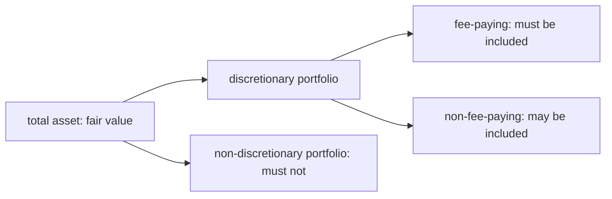

<h1>Ethical and Professional Standards</h1>
For researcher (level I) and fund manager (level III)

<h3>Ethics and Trust in the Investment Profession</h3>
<h4>ETHICS</h4>
<!--  -->
ethics is a set of shared belief about what is good or acceptable and what is bad or unacceptable behavior
* conduct that improve outcomes for stakeholders
* balance your self-interest with the impact on others
<h4>ETHICS AND PROFESSIONALISM</h4>
<h5>Code</h5>
<!--  -->
code is a set of moral principles that guides by describing what is acceptable behavior
* minimum level of ethical behavior

<h5>profession</h5>
<!--  -->
profession is an occupational community that has specific education, expert knowledge and a framework of practice and behavior
* professional code of ethics is a way for profession to communicate to the public
* does not ensure all member follow
* uphold high ethical standard is a difference between professions and craft guilds

for profession, a primary goal is to establish trust among clients and among society in general
fiduciary duty (受托责任) is the obligation to deliver a high standard of care when acting the benefit of another party
professions are evolving

<h5>professionalism in investment management</h5>
<!--  -->
the code for investment is still developing
trust in investment management:
* investment management professionals are trusted to draw on a body of formal knowledge and apply that knowledge with care and judgement
* investment management profession and investment firms must be interdependent

CFA Institute as an investment management professional body:
* mission is "to lead the investment profession globally, by promoting the highest standards of  ethics, education and professional excellence for the ultimate benefit of society"

<h5>challenges to ethical conduct</h5>
<!--  -->
individuals tend to overrate the ethical quality of their behavior
decision makers fail to recognize or underestimate the effect of situational influence (external influence more important than personal trait):
* social pressure from others, violate when they place more importance on self-interest and short-term results than long-term results and ethical quality
* overstrict rule run the risk of so focused on adhering to compliance rules

<h5>Ethical vs. Legal Standards</h5>
<!--  -->
illegal but ethical: whistleblowing
legal but unethical: recommending investment in relative firms
ethical principle often sets a higher standard of behavior than laws and regulations：
* new law and regulations often result from recent instances of what is perceived as unethical

ethical decisions require more judgement and consideration of the impact on stakeholders compared to legal decisions

<h5>Ethical Decision-making Frameworks</h5>
<!--  -->
integrated into a firm decision process
framework: identify, consider, act and reflect

<h3>Code of Ethics</h3>
<!--  -->
<h4>Proceedings (诉讼)</h4>
<!--  -->
primary principles: fairness and confidentialailty
Disciplinary Review Committee (DRC) of the Board has responsibiliy for the Professional Conduct Program (PCP) and enforcement of the Code and Standards
the hearing panel when rejecting disciplinary sanction consists of DRC and CFA Institute member volunteer

<h5>Asset Management Code of Professional Conduct</h5>
AMC was constructed for asset management firm and asset manager

<h5>Code</h5>
<!--  -->
* Act with integrity, competence, diligence, respect, and in an ethical manner with the public, clients, prospective clients, employers, employees, colleagues in the investment profession, and other participants in the global capital market
* Place the integrity of the investment profession and the interests of clients above their own personal interests
* Use reasonable care and exercise independent professional judgement when conducting investment analysis, making investment recommendations, taking investment actions, and engaging in other professional activities
* Practice and encourage others to practice in a professional and ethical manner that will reflect credit on themselves and the profession.
* Promote the integrity and viability of the global capital markets for the ultimate benefit of society
* Maintain and improve their professional competence and strive to maintain and improve the competence of other investment professionals

<h3>Standards I-VII (*)</h3>
<h4>Professionalism</h4>
<h5>I(A) Knowledge of law</h5>
<!--  -->
* know the law related to business
* comply the most strict one
* when violating, dissociate

<h5>I(B) Independence and objectivity</h5>
<!--  -->

<h5>I(C) Mispresentation</h5>
<!--  -->
* overstatement, includes performance, qualification or ability to provide all kinds of service
* omit of fact
* plagiarism:
  * summary of other's opinion without citation is not allowed
  * concepts like "P/E" or "duration" could be illustrated in your own language or with copied opinion with citation
  * statistics like GDP, PPI and CPI could be used without citation
  * other article quotes some material: verify the fact, and direct citation to that material is necessary
  * work completed for the employer, need not to be cited for that employer
* performance analysis: choose appropriate benchmark rate

<h5>I(D) Misconduct</h5>
<!--  -->
* dishonest, fraud and deciet:
* act adverse for his professional reputation: 

<h4>Integrity of Capital Markets</h4>
<h5>II(A) Material nonpublic information</h5>
<!--  -->
material nonpublic information: reliable source, clearly material impact and non-public
Mosaic theory: public material and nonpublic nonmaterial
when proprietary trading activity, market maker best not to stop but remain passive to market, and record document for risk-arbitrage trading

<h5>II(B) Market manipulation</h5>
<!--  -->
infomation based: dissemination of false or misleading information
trasaction based: rat hole or repetitive transaction

<h4>Duty to Clients</h4>
<h5>III(A) Loyalty, prudence and care</h5>
<!--  -->
a framework, concludes all III standards followed, the different points from those are: 
* fiduciary duty: execution trader does not bear fiduciary
* indentifying the actual investment client:
  * individual
  * beneficiary: in pension, client is employees; in trust, client is beneficiary
  * mandate (基金募集说明书): for mutual fund manager, client is mandate
  * investing public: researcher's client
* soft commission: best execution and suitable broker; soft dollar/commission is the gift broker gives to the fund manager; soft dollar directly benefit for manager to make investment decision could be accepted, it is seen as from clients
  * research report/model/computer/database
  * rent and utility fee could not be accepted
* proxy voting: fund manager stands for investor

<h5>III(B) Fair dealing</h5>
<!--  -->
not to discriminate discimination
* fairly is not equally, allow order when reaching clients
* premium level service is okay, if not disadvantage or negatively affect other clients; the availability condition should be disclosed to all clients
* pro rata on order size, round-lot is allowed
* material changes in prior recommendations should be communicated to all clients

<h5>III(C) Suitability</h5>
<!--  -->
* know your clients
* investment policy statement (objective (risk (more important) and return), constraints (liquidity, tax, time, legal, unique))
* consistent with IPS, when considering risk, it should be considered with the entire portfolio

<h5>III(D) Performance Presentation</h5>
<!--  -->
actually included in I(C) Misrepresentation
* include terminated portfolio in performance history
* detailed information
* Apply GIPS standards, should encourage to comply with GIPS
* full disclosure: whether simulated, when the performance record is that of a prior entity

<h5>III(E) Preservation of confidentiality</h5>
<!--  --> 
the information concerns illegal activities could be disclosed unless the law does not allow
maintain confidentiality even if client relationship is terminated

<h4>Duty to Employers</h4>
<h5>IV(A) Loyalty</h5>
<!--  -->
not deprive employer
* on service
  * personal life allowed, except for affecting work
  * work time belongs to employer
  * competitive business not allowed (called independent practice)
  * legal procedure allowed before employment terminated if it has not started yet
* off service
  * customer list could not be taken away; only public information could be used
  * confidential information
  * only knowledge and skill could be used
* social media: ambiguity

<h5>IV(B) Additional Compensation Arrangements</h5>
<!--  -->
business related compensation
compensation from client, if disclosed but have not got consent, this violates IV(B)

<h5>IV(C) Responsibility of Supervisors</h5>
<!--  -->
* prevent mistake: complete policy and procedure, (incentive policy and training)
* detect mistake in time: could delegate, but not relieve of violation responsibility
* when subordinates violate, must initiate an investigation and punish, which ensure the violation will not be repeated

<h4>Investment</h4>
<h5>V(A) Diligence and reasonable basis</h5>
<!--  -->
* using secondary or third-party report: check whether it is sound
* using quantitative oriented research: must understand assumptions and limitations, test output
* selecting external and subadvisor
* group research and decision making: when applying majority rule, he can accept the majority opinion

<h5>V(B) Communication with Clients</h5>
<!--  -->
included in I(C) Misrepresentation
* basic format and general principles, any changes that might materially affect those process
* significant limitations and risks
* distinguish between fact and opinion

capsule form recommendation is allowed but availability of more information should be disclosed
liquidity and capacity (investment ability, like small-cap strategy is not for large size fund)

<h5>V(C) Record Retention</h5>
<!--  -->
fulfill law requirement, or at least 7 years
records are property of the firm, could not be copied

<h4>Conflicts of Interest</h4>
<h5>VI(A) Disclosure of conflicts</h5>
<!--  -->
violation of VI(A) implies violation of I(B)
IV(B) also implies conflict of interest
* conflict between research department and IBD
* no requirement for pension fund

<h5>VI(B) Priority of Transactions</h5>
<!--  -->
client > employer > himself
must leave enough time for clients to make actions
only spouse's account is seen as his account among all relatives

<h5>VI(C) Referral Fees</h5>
<!--  -->
should be disclosed to clients and employers before referral, for clients' price determination

<h4>Responsibility as members</h4>
<h5>VII(A) Conduct as members and candidates</h5>
<!--  -->
providing confidential program is prohibited
improperly using an association with CFA
misrepresentation about CFA
expressing opinion towards CFA is okay

<h5>VII(B) Reference to CFA institute, designation</h5>
<!--  -->
CFA is adjective not noun, use CFA chartholder
should not be given more prominence
could not be put after company name
must be put after true name and full name
complete professional conduct statement (述职报告) and annual fee
candidate: member (after registered), candidate (exam payment)
cannot link CFA to superior performance

<h3>Global Investment Performance Standards (GIPS)</h3>
<!--  -->
only investment firm could claim complying GIPS
firm: distinct business entity that is held out to clients and prospects as the investment firm (bank branch)
<h4>Introduction</h4>
<h5>Composite</h5>
<!--  -->
when there is conflict of law, must comply law and disclose
composite must include all (current and terminated) similar portfolio

determination of which portfolio to include in the composite should be done according to pre-established criteria
selected time period is not allowed

<h5>verification</h5>
<!--  -->
verification is voluntary, should be conducted by independent third party

<h5>objective</h5>
<!--  -->
the establishment of a voluntary global investment performance standard leads to an accepted set of best practices for calculating and presenting investment performance that is readily comparable among investment firms.

<h4>Nine major sections of GIPS</h4>
<h5>0. Fundamentals of Compliance</h5>
<!--  -->
compliant presentation for all prospective clients
provide a complete list of composite, including terminated composite for at least 5 years
change in organization cannot alter historical performance 
firms recommended to adopt the broadest, most meaningful definition of the firm
<h5>1. input data</h5>
value at least monthly, when large cashflow occurs
<h5>2. calculation methodology</h5>
use time weighted rate of return
<h5>3. composite construction</h5>
<h5>4. disclosure</h5>
<h5>5. presentation and reporting</h5>
<!--  -->
when clain complying GIPS, prepare 5 years historical performance, building up historical compliant performance for at least 10 years

<h5>6. real estate</h5>
<h5>7. private equity</h5>
<h5>8. wrap fee/separately mananged account portfolios (SMA)</h5>

