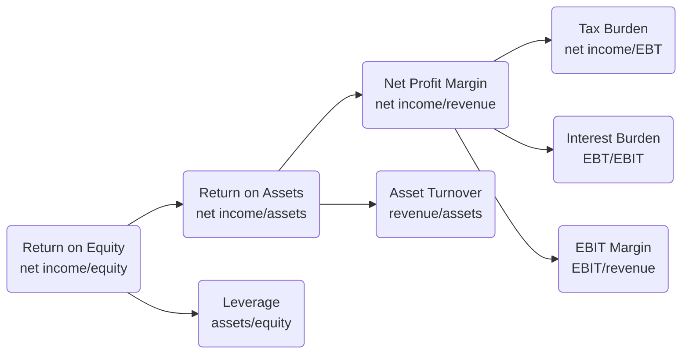

<h1>Financial Statement Analysis (1)</h1>
<h3>INTRODUCTION</h3>
<!-- 476 -->
liquidity: to meet short-term obligations; solvency:the ability to meet long-term obligations
price-to-earnings ratio (P/E)
additional information might include:
* a letter from the chairman of the company
* a report from management discussing the results (might not be audited)
* an external auditor’s report providing assurances
* a governance report describing the structure of the company’s board of directors
* corporate responsibility report

Assets = Liabilities + Owners’ equity (partners’ capital or shareholders’ equity or shareholders’ funds)
Revenue + Other income – Expenses = Income – Expenses = Net income (net earnings, net profit, and profit or loss)
When a parent company owns more than 50 percent of the voting shares of a subsidiary company, it is presumed to control the subsidiary and thus presents consolidated financial statements.
diluted shares (stock options or convertible bonds)
audit opinion: unqualified audit opinion (clean or unmodified opinion), qualified audit opinion, adverse audit opinion and disclaimer of opinion
a classical top-down approach: macroeconomics, industry and then specific company

<h3>Financial Reporting Standards</h3>
<h4>ACCOUNTING STANDARDS BOARDS</h4>
<!-- 516 -->
standard-setting bodies set the standards and regulatory authorities recognise and enforce the standards
International Accounting Standards Board: International Financial Reporting Standards (IFRS)
Financial Accounting Standards Board: Generally Accepted Accounting Principle
<h4>REGULATORY AUTHORITIES</h4>
<!--  -->
the International Organization of Securities Commissions (IOSCO), 3 core responsibilities:
* protecting investors
* reducing systemic risk
* ensuring that markets are fair, efficient, and transparent
  
Sarbanes–Oxley Act: auditor independence, financial reports responsibility, management report
Security and Exchange Commission (SEC)
<h4>IFRS FRAMEWORK</h4>
<!--  -->
CONCEPTUAL FRAMWORK's qualitative characteristics:
|  fundamental   | enhancing  |
|  ----  | ----  |
|relevance(Materiality)  faithful representation| comparability  verifiability Timeliness understandability |
<h4>THE ELEMENTS OF FINANCIAL STATEMENTS</h4>
<!--  -->
two assumptions: accrual accounting and going concern
MEAUSREMENTS:
* historical cost
* amortised cost
* current cost (to obtain)
* realizable value/settlement value (to settle, which means minus expenses)
* present value
* fair value 

<h4>REQUIREMENTS</h4>
<!--  -->
financial statements: 
* balance sheet (statement of financial position or statement of financial condition)
* statement of comprehensive income (also called statement of operations or profit and loss (P&L) statement), a single statement of comprehensive income or combination of an income statement and a statement of comprehensive income that begins with profit or loss from the income statement
* statement of cash flow
* a statement of changes in equity
* notes about significant accounting policies and explanatory notes

<h1>Financial Statement Analysis (2)</h1>
<h3>Income Statements</h3>
<h4>COMPONENTS AND FORMAT</h4>
<!--  -->
revenue (sales, or turnover): ordinary activity
net revenue: net of things like discounts, excise tax
gains (secondary and peripheral) and losses
net income (bottom line)
net income = (i) revenue - expenses in the ordinary activities of the business, + (ii) other income - other expenses, + (iii) gains minus losses.
expenses grouping by nature or grouping by function
multi-step format has gross profit; single-step format
operating profit (operating income, sometimes same as EBIT): deduct operating expenses (like selling, administrative and R&D), before tax and interest (except for financial company where interest is operating expense)
<h4>REVENUE RECOGNITION</h4>
<!--  -->
IFRS's income = revenue + gain
unearned revenue: receive cash in advance
5 steps to recoginze revenue:
1. Identify the contract(s) with a customer
2. Identify the separate or distinct performance obligations in the contract
3. Determine the transaction price
4. Allocate the transaction price to the performance obligations in the contract
5. Recognize revenue when (or as) the entity satisfies a performance obligation

EXAMPLE:
* commercial building concludes various goods and service, but the item cannot be treated seperately because the promise is the building
* Input method to measure the percentage of completion
* variable consideration ($200000 more if completed within 2 years), could only be recognized with confidence

incremental costs of obtaining a contract and certain costs incurred to fulfill a contract must be capitalized under the new standards (i.e., reported as an asset on the balance sheet rather than as an expense on the income statement)
<h4>EXPENSE RECOGNITION</h4>
<!--  -->
matching principle: match the revenue and the cost
period cost: administrative expenses recognized when payment incurs; depreciation is allocated with time
FIFO, LIFO (IFRS does not allow) and weighted average cost 

|      |  IFRS  | GAAP  |
| :----: |  ----  | ----  |
| FIFO |  yes   | yes   |
| LIFO |  no   | yes    |
| weighted average cost |  yes   | yes    |
<h5>DOUBTFUL ACCOUNTS, WARRANTIES</h5>
<!-- 22 -->
DOUBTFUL ACCOUNTS (customer defaulted), WARRANTIES: direct write-off method not allowed, must estimate
<h5>DEPRECIATION AND AMORTIZATION</h5>
<!-- 22 -->
long-lived assets: tangible and intangible (patent)
long-lived assets whose costs are not allocated over time: land and intangible assets with  indefinite useful lives
|      |  IFRS  | GAAP  |
| ---- |  ----  | ----  |
| cost model |  yes   | yes   |
| revaluation model |  yes   | no    |
straight-line method
accelerated method: diminishing balance method (more conservative), net book value (not minus residual value) * straight line ratio * 2 (or 1.5)

A policy that results in recognition of expenses later rather than sooner is considered less  conservative
<h4>DISCONTINUED OPERATIONS AND UNUSUAL OR INFREQUENT ITEMS</h4>
<!-- 30 -->
to be reported separately
Discontinued Operations: a plan to dispose its component operation
Unusual or infrequent items: restructuring charges or gain and loss from selling assets
<h4>CHANGES IN ACCOUNTING POLICY</h4>
<!--  -->
full retrospective (adjust previous financial statement); modified retrospective: adjust opening balances
changes in accounting estimates (such as the useful life of a depreciable asset), adjust current and future periods
correction of an error for a prior period: restating the financial statements
<h4>NON-OPERATING ITEMS</h4>
<!--  -->
investing or financing activities
Specifically, under IFRS, interest and dividends received can be shown either as operating or as investing on the statement of cash flows, while under US GAAP interest and dividends received are shown as operating cash flows. Under IFRS, interest and dividends paid can be shown either as operating or as financing on the statement of cash flows, while under US GAAP, interest paid is shown as operating and dividends paid are shown as financin
<h4>EARNINGS PER SHARE (EPS)</h4>
<!--  -->
capital = debt + equity
Ordinary shares (common stock or common share), paid last in liquidation and benefit most when the company does well.
complex capital structure: issue of financial instruments potentially convertible to common stock
basic EPS (common stock) and diluted EPS
both basic and diluted EPS as well as amounts for continuing operations are required to report
basic EPS = $\frac{\text{Net income - Preferred dividends}}{\text{Weighted average number of shares outstanding}}$
stock (share) dividend or a stock split, the EPS calculation reflects the change retroactively to the beginning of the period
dilutive financial instruments:
* convertible preferred: if-converted method
diluted EPS = $\frac{\text{Net income}}{\text{Weighted average number of shares outstanding + new common shares}}$
* convertible debt
diluted EPS = $\frac{\text{Net income + after-tax interest - prefered dividends}}{\text{Weighted average number of shares outstanding + new common shares}}$, because first minus interest expense then calculate tax
* employee stock options: the treasury stock method (proceeds from exercise to repurchase)

antidilutive: diluted EPS higher than basic EPS, antidilutive securities are not included in the calculation of diluted EPS
<h4>COMMON-SIZE ANALYSIS</h4>
<!--  -->
state each line item as a percentage of revenue, and compare this ratio
compare taxes with pretax income
<h4>RATIOS</h4>
<!--  -->
net profit margin (profit margin/return on sales): Net income/Revenue
gross profit margin: Gross profit/Revenue, where gross profit = revenue - cost of goods
operating profit margin
pretax margin
<h4>COMPREHENSIVE INCOME</h4>
<!--  -->
comprehensive income = net income + other comprehensive income
equity change = net income + OCI - dividend
4 types:
* Foreign currency translation adjustments: subsidiaries' balance sheet
* Unrealized gains or losses on derivatives contracts accounted for as hedges
* Unrealized holding gains and losses on a certain category of investment securities
* Certain costs of a company’s defined benefit post-retirement plans that are not recognized in the current period

Income statement typically includes trading or holding asset
OCI includes available-for-sale asset (neither holding nor trading)
held-to-maturity debt securities reported at amortized cost, no unrealized gains or losses are reported

<h3>Balance Sheets</h3>
<h4>CURRENT AND NON-CURRENT CLASSIFICATION</h4>
<!-- 64 -->
current/noncurrent asset (classified balance sheet) and liquidity-based presentation
current asset: expected to be sold, used up, or otherwise realized in cash within one year or one operating cycle of the business, whichever is greater
non-current asset (long-term, long-lived assets)
business cycle: from acquiring inventory to collect sale cash; from acquiring raw material to covert those into cash
current liability (or):
* expected to be settled in the entity’s normal operating cycle
* held primarily for the purpose of being traded
* due to be settled within one year after the balance sheet date
* does not have an unconditional right to defer settlement of the liability for at least one year after the balance sheet date

working capital = current asset - current liability

<h4>CURRENT ASSETS</h4>
<h5>CASH AND CASH EQUIVALENTS, MARKETABLE SECURITIES AND TRADE RECEIVABLES</h5>
<!--  -->
Cash and Cash Equivalents are financial assets
Financial assets are reported at amortised cost or fair value
trade receivable (account receivable) is also financial asset, reported at net realizable value, approximation for fair value
allowance for doubtful accounts is called a contra account
<h5>INVENTORIES AND OTHER CURRENT ASSETS</h5>
<!--  -->
Inventories are measured at the lower of cost and net realizable value
*under GAAP, when using LIFO or retail inventory method, the lower of cost or market value (replacement cost which less than NRV and more than NRV less a normal profit margin)
Subsequent reversal of an inventory write-down is allowed under IFRS, but not under GAAP
OTHER CURRENT ASSETS: a typical item is prepaid expense, 

<h4>CURRENT LIABILITIES</h4>
<!--  -->
Trade credit is a source of financing
Accrued expenses (accrued expenses payable, accrued liabilities, or other non-financial liabilities): recognized as expense but not paid, such as tax payable, interest payable
Deferred income (deferred revenue or unearned revenue): receive payment in advance of good delivery

<h4>NON-CURRENT ASSETS</h4>
<h5>PROPERTY, PLANT AND EQUIPMENT AND INVESTMENT PROPERTY</h5>
<!-- 79 -->
Property, plant, and equipment (PPE)
Land is not depreciated
Impairment occurs when recoverable amount is less than its carrying amount:
* Recoverable amount: The higher of an asset’s fair value less cost to sell, and its value in use
* Value in use: The present value of the future cash flows expected to be derived from the asset

Reversals of impairment losses are permitted under IFRS but not under US GAAP
revaluation model: the reported is the fair value at the date of revaluation less subsequent depreciation
under the fair value model, investment property's gain or loss arising from change in fair value of investment property is recognized in profit and loss
<h5>INTANGIBLE ASSETS</h5>
<!--  -->
cost model or revaluation model
Intangible assets are identifiable non-monetary assets without physical substance
identifiable asset: can be acquired singly (can be separated from the entity) or is the result of specific contractual or legal rights or privilege
accounting goodwill is not a separately identifiable asset
The revaluation model can only be selected when there is an active market for an intangible asset.
assets (like management skill, good reputation) may be recognised as goodwill if a company is acquired, but are not recognised until an acquisition occurs
internally created identifiable intangibles are expensed rather than reported on the balance sheet, under IFRS, research phase cost should be expensed and development phase cost may be capitalized; under GAAP, most cost should be expensed
expensed cost include:
* internally generated brands, mastheads, publishing titles, customer lists
* start-up costs
* training costs
* administrative and other general overhead costs
* advertising and promotion
* relocation and reorganization expenses
* redundancy and other termination costs

<h5>GOODWILL</h5>
<!--  -->
purchase price's excess amount higher than identifiable assets net of liabilities
accounting goodwill arising from acquisitions is capitalized, not amortised but tested for impairment annually
Any gain from a bargain purchase is recognized in profit and loss
analysts often adjust the companies’ financial statements by removing the impact of goodwill

<h5>FINANCIAL ASSETS</h5>
<!--  -->
fair value or amortised cost method
amortised cost method: initially recognized amount, minus principal repayments, plus or minus amortisation of discount or premium, and minus reduction for impairment
held-to-maturity asset is reported at amortised cost

<h5>DEFERRED TAX ASSETS</h5>
<!--  -->
<h4>NON-CURRENT LIABILITIES</h4>
<h5>Long-term Financial Liabilities</h5>
<h5>Deferred Tax Liabilities</h5>
<!--  -->
<h4>EQUITY</h4>
<!--  -->
components:
* Capital contributed by owners (common stock, issued capital)
* Preferred shares: preferred shares with mandatory redemption at a fixed amount at a future date are classified as financial liability
* Treasury shares: non-voting and no dividend, reissue does not recognize gain or loss
* Retained earnings
* Accumulated other comprehensive income (or other reserves)
* Noncontrolling interest: minority shareholders in the subsidiary companies that have been consolidated by the parent (controlling) company

<!--  -->
<h4>STATEMENT OF CHANGES IN EQUITY</h4>
<!--  -->
information required:
* total comprehensive income
* the effects of any accounting changes
* capital transactions with owners and distributions to owners
* reconciliation of the carrying amounts of each component of equity

<h4>COMMON SIZE ANALYSIS</h4>
<!--  -->
as a percentage of total assets
<h4>RATIOS</h4>
<!--  -->
|Liquidity Ratios|Calculation|
| ---- |  ----  |
| current | Current assets / Current liabilities |
| Quick (acid test) |  (Cash + Marketable securities + Receivables) / Current liabilities   |
| Cash | (Cash + Marketable securities) / Current liabilities |

|Solvency Ratios|Calculation|
| ---- |  ----  |
| Long-term debt-to-equity | Total long-term debt / Total equity | 
| Debt-to-equity |  Total debt / Total equity   |
| Total debt | Total debt / Total assets |
| Financial leverage | Total assets / Total equity |  

for diversified companies operating in different industries, look ratio for different operating segments

<h3>Cash Flow Statements</h3>
<h4>CLASSIFICATION OF CASH FLOWS AND NON-CASH ACTIVITIES</h4>
<!-- 120 -->
* Operating activities: including dealing securities and trading securities
* Investing activities
* Financing activities:
IFRS: operating leases are treated similarly to finance leases, interest is financing or operating, principal is financing

|  |  IFRS  |  GAAP  |
| ---- |  ----  |  ----  |
| interest paid | operating or financing | operating |
| interest received | operating or investing | operating |
| dividend paid | operating or financing | financing |
| dividend received | operating or investing | operating |

non-cash transaction: such as exchange asset, stock for dividend, convertible bond
<h4>DIFFERENCE</h4>

<h4>DIRECT AND INDIRECT METHODS FOR OPERATING</h4>
<!--  -->
indirect method: a reconciliation of net profit to net cash flow from operating activities
GAAP encourage direct method but require companies a reconciliation between net income and cash flow (which is equivalent to the indirect method)
US GAAP mandate disclosure of cash for interest and income taxes under indirect method
<h4>LINKAGES OF CASH FLOW STATEMENT WITH THE INCOME STATEMENT AND BALANCE SHEET</h4>
<!--  -->
accounts receivable's change = revenue - cash collected from customers
<h4>THE DIRECT METHOD FOR OPERATING ACTIVITIES</h4>
<!--  -->
* Cash Received from Customers
* Cash Paid to Suppliers:
purchase from supplier = cost of good sold + change of inventory
* Cash Paid to Employees
* Cash Paid for Other Operating Expenses
Other operating expenses = (cash paid - change of prepaid expense) + change of other accrued liability 
* Cash Paid for Interest
* Cash Paid for Income Taxes
Cash flows from taxes must be separately disclosed under IFRS and GAAP
<h4>INVESTING ACTIVITIES</h4>

<h4>FINANCING ACTIVITIES</h4>
<!--  -->
* Long-Term Debt and Common Stock
* Dividends: change of retained earning = net income - dividend
<h4>OVERALL STATEMENT OF CASH FLOWS UNDER THE INDIRECT METHOD</h4>
<!-- 146 -->
To perform this reconciliation, net income is adjusted for: 
* non-operating activities
* non-cash expenses
* changes in operating working capital items

<h4>FROM INDIRECT TO DIRECT</h4>

<h4>SOURCES AND USES OF CASH</h4>
<!--  -->
* major sources and uses of cash flow
whether operating cash flow is positive and sufficient to cover capital expenditures
* primary determinants of operating cash flow
higher or lower than net income
* primary determinants of investing cash flow
* primary determinants of financing cash flow

<h4>COMMON SIZE ANALYSIS</h4>
<!--  -->
denominator: total cash inflow/outflow or net revenue

<h4>FREE CASH FLOW TO FIRM AND FREE CASH FLOW TO EQUITY</h4>
<!-- 160 -->
free cash flow: the excess of operating cash flow over capital expenditures
FCFF = NI + NCC + Int(1 – Tax rate) – FCInv – WCInv
FCFF = CFO + Int(1 – Tax rate) – FCInv
FCFE = CFO – FCInv + Net borrowing
<h4>RATIO</h4>
???

<h3>Financial Analysis Techniques</h3>
<!-- 176 -->
for return on assets (ROA), average asset would be better than beginning and ending (for company with growing assets)
return on equity (ROE) is net income divided by average shareholder's equity
Trailing 12 months (TTM) (past 12 months) or most recent quarter (MRQ)
<h4>COMMON SIZE BALANCE SHEETS AND INCOME STATEMENTS</h4>
<!-- 189 -->
time series analysis: horizontal common-size balance sheets
vertical common-size income statement: each column is divided by the same entry

<h4>ACTIVITY RATIOS</h4>
<!--  -->
asset utilization ratios or operating efficiency ratios

* inventory turn over: how many times per year the entire inventory was theoretically turned over, or sold
may imply effective inventory management or inadequate inventory
* DOH: the company kept on hand about 30 days’ worth of inventory, on average, during the period
* DSO: the elapsed time between a sale and cash collection
* payable turnover
If liquidity ratios indicate that the company has sufficient cash and other short-term assets to pay obligations and yet the days payable ratio is relatively high, the analyst would favor the lenient supplier credit and collection policies as an explanation.
* fixed asset turnover
A low ratio can indicate inefficiency or new business not operating at full capacity
this ratio could change dramaticly because fix asset does not follow smooth pattern

<h4>LIQUIDITY RATIOS</h4>
<!--  -->

Contingent liability, such as letters of credit or financial guarantees
* defensive interval ratio: all expenditure on income statement excluding noncash and tax 
how long a company can pay its daily cash expenditures using only its existing liquid assets, without additional cash flow
coming in
* cash conversion cycle: the length of time funds are tied up in working capital, from cash paid to cash received
must finance its inventory and accounts receivable for a longer period of time

<h4>SOLVENCY RATIOS</h4>
<!--  -->
Leverage is a magnifying effect that results from the use of fixed costs
operating leverage results from the use of non-current assets with fixed costs;financial leverage results from the use of long-term debt with fixed costs 

* Debt-to-EBITDA Ratio: how many years it would take to repay total debt based on EBIT
* Interest Coverage: the number of times a company’s EBIT could cover its interest payments

<h4>PROFITBILITY RATIOS</h4>
<!--  -->

* ROA: net income/total assets
net income is the return to equity holders, whereas assets are financed by both equity holders and creditors
<h4>DUPONT ANALYSIS: THE DECOMPOSITION OF ROE</h4>
<!-- 221 -->

<h4>EQUITY ANALYSIS AND VALUATION RATIOS</h4>
<!--  -->
| Valuation Ratios |  Numerator  |  Denominator |
| ---- |  ----  |  ----  |
| P/E 市盈率 | share price | earnings per share |
| P/CF 市现率 | share price | cash flow per share |
| P/S 市销率 | share price | sales per share |
| P/B 市净率 | share price | book value per share |

PE ratio: more susceptible to manipulation than are cash flows, therefore use P/CF

Per-Share Quantities:
* EPS
affected by share number, although sometimes number means nothing
* Dilute EPS
* Cash flow per share = Cash flow from operations / all share
* EBITDA per share = EBITDA / all share
* Dividends per share = Common dividends declared / ordinary share

Dividend-Related Quantities:
* Dividend payout ratio = common share dividends / common share net income
* Retention rate ($b$) = 1 - Dividend payout ratio
* Sustainable growth rate = $b$ × ROE

<h4>INDUSTRY-SPECIFIC FINANCIAL RATIOS</h4>
<!--  -->
business risk ratio:
Coefficient of variation of operating income/net income/revenue: std/mean
???

<h4>RESEARCH ON FINANCIAL RATIOS IN CREDIT AND EQUITY ANALYSIS</h4>
<!-- 231 -->

<h4>CREDIT ANALYSIS</h4>
<!--  -->
credit scoring, credit rating
???

<h4>BUSINESS AND GEOGRAPHIC SEGMENTS</h4>
<!--  -->
the segment constitutes 10 percent or more of the combined operating segments’ revenue, assets, or profit should disclosed separately, additional reportable segments should be identified until 75% revenue is reached, other segments are in "all other segments" category

