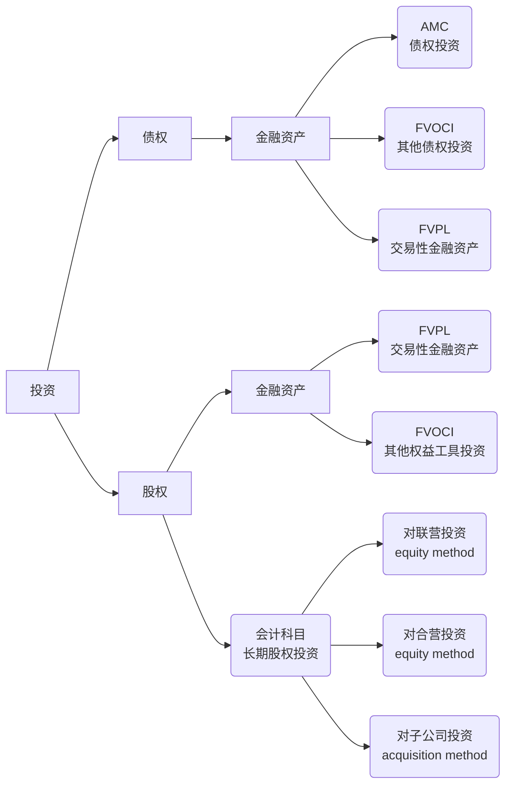

<ndtag category="CFA II" tag="Financial-Statement-Analysis" createdate="2025-08-09" editdate="2025-08-09"></ndtag>

Key points: C1, C2 and C3
### <!-- C1 p13 --> Intercorporate Investments
#### Basic Corporate Investment Categories

FVPL: fair value measured and in Profit and Loss
FVOIC: fair value measured and in Other Comprehensive Income
AMC: amortized cost

Investments in securities can be categorized as:
* Investment in financial assets: investor has no significant influence and control
* investment in associates: exert sigificant influence but not control
* Joint ventures: control is shared
* Business combinations: investments in subsidiaries 

Percentage of ownership to determine significance of influence (only a guideline)
The final decision is based on degree of influence and control
* lack of influence: less than 20%
* significant influence: between 20% and 50%
* control: more than 50%
 
#### Investments in Financial Assets
Key points: Classification

##### Classification of Financial Assets
CFA II focuses on new standards, old standards in CFA I should be deserted.
Two criterial:
* cashflow characteristic test (objective): whether contractual cashflow are solely payments of principal and interest on principal
* business model test (subjective): how to generate cashflow
  * by collecting contractual cash flows
  * by selling financial assets
  * both

###### Basic Principles
1. measured at AMortized Cost (AMC): accord with cash flow characteristic test and held to collect contractual cashflows
   * account receivable
2. measured at Fair Value through Other Comprehensive Income (FVOCI): accord with cash flow characteristic may be sold (hold to collect and sell)
3. measured at Fair Value through Profit or Loss (FVPL): other remaining financial assets

###### *Supplement
* derivative are measured at FVPL (except for hedging)
* embedded derivatives are not separated from hybrid contract, the asset as a whole is measured at FVPL
* management could designate assets as FVPL to avoid account mismatch (e.g., to match a FVPL financial liablility)
* management could designate nontradable equity investment as FVOCI
  * only dividend income is recognized in PL

The designation choice is irrevocable.

##### Measurement
all financial assets are measured at fair value when initially acquired
* equity example: T=0, buy 10 stocks@10; T=1, receive dividend 1 per share; T=2 sell 4@12
  * FVPL: 
    * T=0, `cash -100, FVPL +100`
    * T=1, `cash +10` | `RE (retained earnings) +10`
    * T=2, `FVPL +20` | `RE +20`
    * T=2 sell, `cash +48,  FVPL -48`
  * *FVOCI: 
    * T=0, `cash -100, FVOCI +100`
    * T=1, `cash +10` | `RE (retained earnings) +10 (through PL)`
    * T=2, `FVOCI +20` | `AOCI (accumulated OCI) +20 (through OCI)`
    * T=2 sell, `cash +48, FVOCI -48` | `AOCI -8 and RE +8 (not through PL)`
* debt example: T=0, buy a bond@951.96, 3 year 10% coupon rate, par value 1000, YTM=12%
  Fair value (exogenously given): T=0, 951.96; T=1 980; T=2, 999; T=3 1000
  Amotized costs: T=0, 951.96; T=1 966.2; T=2, 982.14; T=3 1000
  * AMC:
    * T=0, cash -951.96, AMC +951.96
    * T=1, `cash +100, AMC +14.24` | `RE +951.96*12%=114.24`
    * T=2, `cash +100, AMC +15.94` | `RE +966.2*12%=115.94`
    * T=3, `cash +100, AMC +17.86` | `RE +982.14*12%=117.86`
    * T=3 expired, `cash +1000 AMC -1000`
  * FVOCI:
    * T=0, `cash -951.96, FVOCI +951.96`
    * T=1, `cash +100, FVOCI +28.04` | `RE +114.24, AOCI +13.8`
    * T=2, `cash +100, FVOCI +19` | `RE +115.94, AOCI +3.06`
    * T=3, `cash +100, FVOCI +1` | `RE +117.86, AOCI -16.86`
    * T=3 expired, `cash +1000, FVOCI -1000` 
  * FVPL:
    * T=0, `cash -951.96, FVPC +951.96`
    * T=1,  `cash +100, FVOCI +28.04` | `RE +128.04`
    * T=2,  `cash +100, FVOCI +19` | `RE +119`
    * T=3,  `cash +100, FVOCI +1` | `RE +101`
    * T=3 expired, `cash +1000, FVOCI -1000`
  * same influence on PL

###### Impairment of Financial Assets
expected loss model:
* 12 month expected loss for performing asset
* life time expected loss for nonperforming asset (siginificant credit risk)

##### Reclassification
Under IFRS 9, reclassification of equity instruments is not permitted.
* designation of FVPL and FVOIC is irrevocable

Reclassification of debt instruments permitted if business model change. (infrequent)
There is no restatement on actual reclassification date, but on the first day of next accounting period.

#### Investments in Associates
##### Equity Method of Accounting
IFRS also includes currently exercisable (in 1 year) call options and etc. in determination of significant influence; GAAP only consideres outstanding shares.
Significant influence evidence:
* representation on board of directors
* material transactions between investor and investee
* interchange of managerial personnel
* technological dependency

Equity method: 
* balance sheet: one-line concolidation (单项合并, against line by line) `equity investment in associate`, noncurrent asset
  * proportionate ownership interest in net assets of the investee
* income statement: single line item `equity income in associate`
  * equity income is separated from operating income 

###### Basic Principles
Carrying amount of the investment is adjusted to recognize the investor's proportionate share of the investee's earnings or loss, and these earnings or losses are reported in income.
* dividend treated as return of capital and not in PL
  * example: B invests 30% in S, S realize \$80 and dividend \$20 (big and small)
    * dividend to B: `cash +6, investment +24-6` | `RE +24`

cost method is more prudential against equity method
* dvidend to B: `cash+24` | `RE+24`

If the investment value is reduced to 0, the equity method is discontinued to record, but further loss should be recorded in another book and regarded as provision.

###### Excess Purchase Price
In general, Purchase Price (PP) > % fair value > % book value (of net identifiable assets, not including goodwill).
* Excess PP = PP - % book value
* % fair value appreciation = % fair value - % book value
  * amortized to the investee's profit over economic life of asset
* goodwill = PP - % fair value
  * not amortized and review for impairment

Goodwill is included in carrying amount of the investment instead of being separately recognized.

Amortization of Fair Value Appreciation:
* excess PP is expensed (inventory) or amortized in a way consistent with the specific asset
  investor must record these adjustment effects by reducing the carrying amount on its balance sheet and reducing investee's profit recognized on its income statement
  over time, the balace in the investment account will come closer to owner's percentage of book value of net assets of associate
  * example: B invests 30% in S with 2000, S has PPE BV=110 FV=120 (10 years life), S report 1000 net income and pays dividend 500
    * S: NI = 1011 - 110/10
    * B: equity income = (1011 - 120/10)*30%
    * B: equity investment = 2000 + 999\*30% - 500\*30%

###### Transactions with Associates
* Profits from such transactions cannot be realized until confirmed through sale to third parties or use (regardless to sale price)
* investor company's share of any unrealized profit must be defered by reducing the amount recorded under the equity method 
* downstream transactions (顺流交易, goods from investor to investee) and upstream transactions

upstream transaction:
* example: D invests 20% in E, E sell good (cost 600) to D at 900 at T=0, D use it as PPE, expected life 10 years, net residual value 0, T=1 E has net profit 1600
  * E: adjusted net profit = 1600 - (900 - 600) + (900 - 600)/10
  * D: investment profit = 1330*20%

downstream transaction:
* same adjustment to upstream transaction, although profit is of investor.
* offest as much as possible

##### Other Issues
###### 1. Impairment
Impairment is other than temporary.
Impairment loss is recorded on the income statement, the carrying amount of investment is reduced or through the use of an allowance account
Both IFRS and US GAAP prohibit the reversal of impairment loss.
Goodwill is included in carrying amount of the investment, not separately recognized and not separately tested.

###### 2. Fair Value Option
Option that whether to use fair value method to measure long term investment at initial recognition.
It is measured like FVPL, excess PP is not amortized and no goodwill. 
Under IFRS, the use is restricted to venture capital, mutual funds and etc.

#### Business Combinations
control and variable interest (debt is not variable interest)

##### Basic Concepts about Combinations
*under US GAAP:
* acquisition (控股): A + B = A + B (buyer prepares consolidated financial statement) 
* merger (吸收合并): A + B = A (B's entity canceled)
* consolidation (新设): A + B = C

acquisition method (A and B have different control party)

##### Consolidation Process
Balance sheet process:
1. adjust subsidary based on fair value 
2. add parent company book value and child company's all fair value, calculate minority interest
3. offset carrying amount of investment and % child company's equity, calculate goodwill and non-controling (minority) interest

Income statement process:
1. add revenue and cost
2. offset business bewteen parent company and child company, adjust child company's fair value
3. calculate adjusted non-controling (minority) interest (same as equity method of investment in associates) and net income attribute to owners of the parent

direct costs are expensed as incurred, not counted as acquisition cost

##### Accounting Treatment of Goodwill

#### Joint Venture and Spes/Vies
#### Analysis Issues
##### Net Income and Shareholder's Equity
##### Two Common Analysis Frameworks
##### Issue for Equity Method

### <!-- C2 p73 --> Employee Compensation: Post-Employment and Share-Based
### <!-- C3 p125 --> Multinational Operations
### <!-- C4 p211 --> Analysis of Financial Institutions 
### <!-- C5 p295 --> Evaluating Quality of Financial Reports
### <!-- C6 p379 --> Integration of Financial Statement Analysis Techniques
### <!-- C7 p421 --> Financial Statement Modeling
