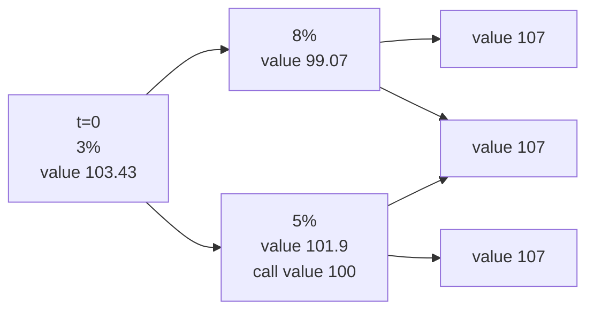
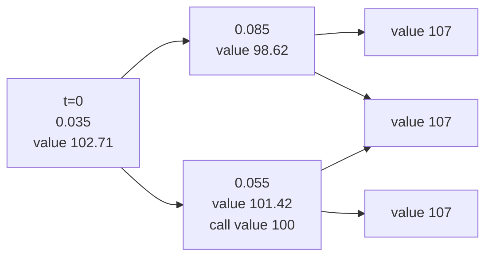

<ndtag category="CFA II" tag="Fixed-Income" createdate="2025-08-16" editdate="2025-08-17"></ndtag>

keypoints:
* C1 Rates and Curves
* C3 Traditional Term Structure Theories

### <!-- C1 p355 --> The Term Structure and Interest Rate Dynamics
lender/creditor vs. borrower/debter

#### Rates and Curves
* Spot Rate (Zero Rate): rate of default-free zero-coupon bond
  * discount factor: $P(j)=\frac{1}{[1+s(j)]^j}$
* Forward Rate $f(j,k)$: from $j$ to $j+k$
  * discount factor $F(j,K)=\frac{1}{[1+f(j,k)]^k}$
  * forward curve: relationship bewteen $f(m,n)$ and $n$ when $m$ fixed as a time point in the future
  * forward rate model: $[1+s(j+k)]^{j+k}=[1+s(j)]^j[1+f(j,k)]^k$
  * Relationship between Curves
    * spot curve upward sloping, forward curve lies above spot curve $f(i,j)>s(i+j)>s(i)$
    * in developed markets, yield curves are like $\ln x$ shape
    * humped yield curve: midterm rates are higher than short term and long term
* Par Rate: the coupon rate that price of the bond equal to par value
  * par curve: par rate corresponded to spot curve
  * recently issued (on the run) treasury bonds are typically priced close to par value
  * bootstrapping: obtain spot curve from par curve
* YTM
  * a weighted average of spot rate
* Swap Rate: interest rate for the fixed-rate leg of an interest rate swap
  * $\sum\frac{s(T)}{[1+r(t)]^t}+\frac{1}{[1+r(T)]^T}=1$, equivalent to par rate
  * swap curve is a type of a par curve
  * swap rate curve is prefered because: 
    * it has more maturities and liquidity
    * reflect credit risk
    * swap market is unregulated (not controlled by governments), so comparable across different countries
 
#### Spread
* Swap spread = swap rate - government security rate (on the run)
* I-Spread = bond rate (YTM) - swap rate
  * I is for interpolated swap rate
* TED Spread = LIBOR - T-bill rate
  * T is for treasury bill and ED is for Eurodollar
  * indicator of perceived credit risk in the general economy
* Libor-OIS Spread = LIBOR - overnight indexed swap rate
  * OIS is interest rate swap where floating rate is geometric average of an overnight index rate over every day
  * indicator of risk and liquidity of money market securities 
* G-Spread (nominal spread) = I-Spread + Swap spread
* Z-Spread: $P=\sum\frac{CF_t}{[1+s(t)+z]^t}$
  * not appropriate for bonds with embedded options

#### Traditional Term Structure Theories
* Pure/Unbiased Expectation Theory
  * Forward rate is an unbiased predictor of the future spot rate, $f(j,k)=\mathbb {E}[s(k)|\mathcal{F}(j)]$.
  * Assume risk neutrality, but investors are risk averse.
* Local Expectations Theory
  * Assume risk neutrality only in the short term, expected return for every bond is the same.
  * But short holding period return on long-dated bonds do exceed those on short-dated bonds.
* Liquidity Preference Theory
  * forward rate = expected spot rates + liquidity premium
  * liquidity premium increases with maturity
* Segmented Market Theory
  * each maturity sector is a segmented market, and independent from each other.
* Prefered Habitat Theory
  * Make investor deviate from their preferred maturities or habitats with enough permium

#### Yield Curve Factor Models
##### Yield Curve Movement
yield curve movements = parallel movements $\Delta X_L$ + steepness movements $\Delta X_S$ + urvature movements $\Delta X_c$
* parallel shift → effective duration
* non-parallel shift → key rate duration

Duration:
* Macaulay duration: $\text{MacDur}=\sum\frac{PV(CF_i)i}{\sum PV(CF_i)}$
* Modified duration: $\text{ModDur}=\frac{\text{MacDur}}{1+r}$, $r$ is YTM per period
  * $\frac{\Delta p}{p}=-\text{ModDur}\Delta y+\frac{1}{2}C\Delta y^2$
* Effective duration: $\text{EffDur}=\frac{PV_+-PV_-}{2PV_0\Delta y}$
* Key rate duration: small change of yield in a specific maturity segment $\text{KeyRateDur}^k=\frac{PV_+-PV_0}{2PV_0\Delta r^k}$
* PVBP (DV01)

##### Key Rate Duration
for the portfolio composed by zero-coupon bonds:
* Key Rate Duration: $w_iD_i$
* Effective Duration: $\sum \text{KeyDur}_i$ 

##### Managing Yield Curve Risks
$\frac{\Delta p}{p}=-D_L\Delta X_L-D_S\Delta X_S-D_C\Delta X_C$
* $\Delta X_L$, $\Delta X_S$, $\Delta X_C$ is sensitivities (principal component) of portfolio value to small changes of three factors

##### Interest Rate Volatilities
short-term rates are more volatile than long-term rates (downward volatility structure)
* short-term volatility linked to monetary policy
* long-term volatility linked to real economy and inflation

interest rate follows lognormal model, $\sigma_\text{annual}=\sigma_\text{month}\sqrt{12}$

#### Active Bond Portfolio Management
* Strategy of Forward Contract: forward of a bond
  * If trader expects the future spot rate will be lower than predicted by the prevailing forward rate, the forward contract value is expected to increase. The trader should long the contract.
* Strategy of Riding the Yield Curve
  * Yield curve is upward sloping and yield curve will not change its level and shape.
  * buy bonds with a maturity longer than investment horizon
  * as bond approaches maturity or "rolls down the yield curve", it is valued at lower yields

#### Developing Interest Rate Views Using Macroeconomic Variables
Bond Risk Premium: term premium
Macroeconomic factors influence bond:
* inflation: short and intermediate term bond yield variation
* monetary policy: long term yield variation
  * during expansions, government makes action that increases short term yield more than long term, called bearish flattening
  * during recessions, government makes action that decreases short term yield more than long term, called bullish steepening
* fiscal policy: budget deficits increase, interest rate will increase

Investor strategies:
* during highly uncertain market periods, flight to quality (long term bond) happens.
  * long term rate falls by more than short term rates, bullish flattening
  * investor may seek to capitalize the bullish flattening with barbell position (equal portion of short term and long term)

### <!-- C2 p421 --> The Arbitrage-Free Valuation Framework
keypoints:
* Binomial Tree Model

#### Arbitrage-Free Valuation
Result of law of one price.
Types of arbitrage opportunities:
* value additivity
  * stripping: separate the security's individual cashflow
  * reconstitution: combine the individual securities to reproduce
* domnance: risk-free pay off

Bonds with embedded options: cashflow depend on the change of interest rate.

#### Term Structure Models
* Equilibrium Term Structure Models
  * Vascicek Model: $dr_t=k(\theta-r_t)dt+\sigma dZ$
  * Cox-Ingersoll-Ross (CIR) Model: $dr_t=k(\theta-r_t)dt+\sigma\sqrt{r_t}dZ$
    * individuals determine optimal trade-off between consumption and investment, interest rate will reach a market equilibrium
* Arbitrage Free Models
  * Ho-Lee Model: $dr_t=\theta_t dt+\sigma dZ$
    * calibrate $\theta_t$ to fit the market price
  * Kalotay-Williams-Fabozzi (KWF) Model: $d\ln r_t=\theta_t dt+\sigma dZ$
    * prevent negative rates

#### Binomial Tree Model
##### Binomial Interest Rate Tree
* lognormal interest rate
* $u=e^{\sigma}$ and $d=e^{-\sigma}$
* Assumes equal probability of up or down

##### Valuing Option-Free Bonds
An example.

##### Construct Binomial Interest Rate Tree
Let implied $f(1,1)$ be kind of mean of $r_u$ and $r_d$ subjected to constraints $r_u=r_de^{2\sigma}$.

##### Pathwise Valuation

#### Monte Carlo Method
Monte Carlo supports path dependent models.

### <!-- C3 p471 --> Valuation and Analysis of Bonds with Embedded Options
#### Callable and Putable Bond
##### Bonds with Embedded Option
###### Basic Concepts
* callable bond: issuer has the option to call back the bond
  * $V_{\text{callable}}=V_{\text{straight}}-V_{\text{call}}$, investor is long bond and short call
  * sinking fund bond (no embedded option): issuer set aside fund to retire the bond, reducing credit risk
* putable bond: investor has the option to put back the bond
  * $V_{\text{putable}}=V_{\text{straight}}+V_{\text{put}}$, investor is long bond and long put
* extendible bond: holder has the right to keep the bond after maturity, with another coupon
  * equivalent to putable bond
    * 3 years putable bond with 2 years locking period
    * 2 year extendible bond having the option extending to 3 years
* convertible bond: bondholder has  the option to convert bond into common stock
* bonds with estate put: heirs of an investor to put he bond back to the issuer upon death of the investor

###### Valuation by Binomial Interest Rate Tree
example of callable bond:
* 2-year 7% annual-pay bond, par value of 100 and callable at 100 at the end of year 1
* interest rate is 3% for year 1, and 8% or 5% for year 2

###### Effects of Interest Rate Volatility
$R_u=R_de^{2\sigma\sqrt{t}}$

##### Option Adjusted Spread
###### Calculation
yield spread that remove the influence of embedded option
OAS = Z-spread - option value (%), actually option value (%) = Z-spread - OAS
* (?) callable bond: OAS < Z-spread
  * (-) some nodes of the tree will have higher value, a higher yield must be used to fit the market price

If the market price of callable bond is 102.71, the OAS will be 50 bps

###### Application
OAS does not reflect option risk, because option value (%) = Z-spread - OAS.
When use issuer-specific as benchmark and assume little liquidity risk, actual OAS should be 0.

##### Interest Rate Risk
###### Effects of Changes in the Shape Of Yield Curve
embedded call option value increase as interest rate decline

###### Effectvie Duration
* effective duration of both callable and putable bond
* $r$ decrease, effective duration of callable bond will decrease
* effective duration of floating-rate bond $\approx$ time to next reset
  * at time to reset, par = price 

###### Effective Convexity
$\text{Effective Convexity}=\frac{PV_++PV_--2PV_0}{PV_0(\Delta \text{curve})^2}$
straight bond exhibiits low positive convexity
relation ship between bond price and interest rate is like $\frac{1}{1+x}$
* callable bond: 
  * when call is in the money, the effective convexity turns negative
* putable bond: 
  * (?) when put is in the money, the effective convexity is higher than the straight bond

###### One-Sided Duration
$\text{up dur}=\frac{PV_+-PV_0}{PV_0\Delta y}$
one-sided durations are better at capturing the interest rate sensitivity of callable bond or putable bond when ATM

###### Key Rate Duration
In the text book, key rate duration of this section refers to par duration.
for option-free bond traded at par, maturity matched rate is the only rate affects the bond's value

#### Capped or Floored Floating-Rate Bond
Floating Rate Bonds: coupon rate = reference rate + quoted margin
coupon payments are in arrears: based on previous period's reference rate

##### Definition and Application
capped floater: coupon rate would not exceed the cap
value of capped floater = value of straight floater - value of embedded cap

##### Calculation of Floater with Cap or Floor
Binomial Interest Rate Tree

##### Ratchet Bond
棘轮债券\单边转动债券
At the time of reset, the coupon can only decline; whenever a coupon is reset, the investor has the right to put the bonds back to the issuer at par.

#### Convertible Bond
Convertible Bond: bondholder has the right to exchange the bond for a specified number of common shares during conversion period (predetermined) and conversion price (predetermined).

##### Basic Concepts
* conversion ratio: number of common shares 
* conversion price = issue price / conversion ratio
  * typically conversion bonds are issued at par value
* market conversion price: current convertible bond price / conversion ratio
* market conversion premium per share = market conversion price - market share price
* conversion value = market share price × conversion ratio
* straight value: value of bond if not convertible
* minimum value = max(conversion value, straight value)

##### Analysis
premium over straight value = convertible bond price / straight price - 1
When stock price increases, convertible bond will underperform than buy the stock
convertible bond = straight bond + call option on stock
convertible bond = straight bond + put option on bond

### <!-- C4 p551 --> Credit Analysis Models
#### Modeling Credit Risk
##### Expected Loss
Expected loss = probability of default × loss given default
loss given default + recovery rate = 1
loss given default is compared to face value
probability of default:
* actual PD
* risk-neutral PD

risk-neutral PD is higher than actual PD because the observed spread also includes liquidity and tax considerations.
hazard rate: default rate conditional on that no default happens before
* example: hazard rate = 10%
  * probability of default at the end of year 1, 2, 3: 10%, 9%, 8.1%
  * probability of survivorship at the end of year 1, 2, 3: 90%, 81%, 72.9%

##### Credit Valuation Adjustment
Value of corporate bond = VND - CVA
* VND: value of bond assuming no default
* CVA: PV of expected loss

#### Valuing Risky Bonds
3-year 5% coupon bond trading at 104 per 100 face value: 
* flat government bond yield curve 2.5%
* initial POD is 1.25%, called hazard rate
* default only occurs at year end
* par value is 100
* recovery rate is 40%

|Year|Exposure|Recovery|LGD|POD|POS|EL|DF|PVEL|
|:-:|:-:|:-:|:-:|:-:|:-:|:-:|:-:|:-:|
|1|109.819|43.9274|65.89|1.5%|98.50%|0.983|0.976|0.964|
|2|107.439|42.9756|64.46|1.48%|97.02%|0.952|0.952|0.907|
|3|105|42|63|1.46%|95.57%|0.917|0.929|0.851|

#### Credit Spreads
corporate bond yield = benchmark yield (macroeconomic factors) + spread (liquidity taxation)
credit term structure
* highly rated securities: flat or slightly upward sloping
* low credit quality: steeper upward sloping or downward-sloping curve.

#### Credit Analysis for Securitized Debt
ABS does not default, but they can lose value.
* Granularity of the portfolio: based on portfolio summary statistics

Covered bond: a predetermined underlying collateral pool
* dual recourse: both the unsecured security and the collateral pool

#### Credit Models
##### Credit Scores and Credit Ratings
* credit scoring:
  * small business and individuals
  * ordinal ranking, do not tell difference among different banks
  * FICO (Fair Isaac Corporation)
* credit ratings:
  * company, government (sovereign), ABS

BBB and above is investment grade, see <a href="https://rfmeng.github.io/pages/CFA%20I/CFA%20I%20-%20Fixed%20Income%20(2).html#nav2.3">credit ratings</a>.
Issuer-pays model for compensating credit-rating agencies has a potential conflict of interest.
Credit transition matrix: probability of rating transition

##### Structural Model
* Option Analogy for Equity and Debt
    * company's equity equivalent to own a European call.
    * company's debt equivalent to owning the company asset and sell a call.
    * company's debt equivalent to owning the riskless bond and sell a put.
* Features of Structural Model
  * PD is endogenous to this model, and not affected by the environment
  * do not consider business cycle

##### Reduced Form Model
$D_t = \mathbb{E}\frac{K}{\prod(1+r_t)}$
* risk-free interest rate is stochastic
* PD varies with the economy
* Recovery rate is stochastic
* default is exogenous

Features:
* model inputs could be historical estimation
* do not explain reason for default

### <!-- C5 p627 --> Credit Default Swaps
#### Structure and Features of CDS
types of credit derivative:
* total return swap
* credit spread option
* credit-linked notes
* CDS

CDS: credit protection buyer make cash payments to receive compensation from the default.
* protection/CDS buyer: short CDS (risk)
* trigger event
  * bankruptcy
  * failure to pay even after a grace period
  * restructure: creditor gives up some profit
* physical settlement: delivery of the debt in exchagne for payment of notional amount

#### Types of CDS
* Single-name CDS
  * one reference entity and one reference obligation
  * designated instrument being covered: same or higher rank
  * cheapest to deliver: if physical settlement, CDS buyer could buy the cheapest bond to deliver, this is equivalent to CDS seller compensated for the maximum amount
* Index CDS (CDX)
  * notional principle: sum of protection on all borrowers
  * higher correlation, higher CDS spread
* Tranche CDS: buyer gets compensation only if cumulative default hits that layer

#### Pricing of CDS
CDS spread:
* standardization: fixed coupon 1% for investment grade and 5% for high yield company
* credit spread ≈ upfront premium / duration + fixed coupon
* profit ≈ change in spread (%) × duration of CDS

CDS price in currency per 100 par ≈ 100 - upfront premium (%)
* upfront premium's direction is for protection buyer
* upfront premium could be negative if credit risk is low and the seller pays to the buyer

#### Application of CDS
* managing credit exposure
  * adjustment of credit exposure
  * naked CDS
  * long/short trade: long CDS on one entity and short CDS on another one
  * curve trade: long CDS of one maturity and short CDS on another one
* valuation disparity
  * basis trades: borrow money, buy bond and CDS to arbitrage
  * synthetic CDO (collateralized debt obligation): buy default-free securities and sell CDS