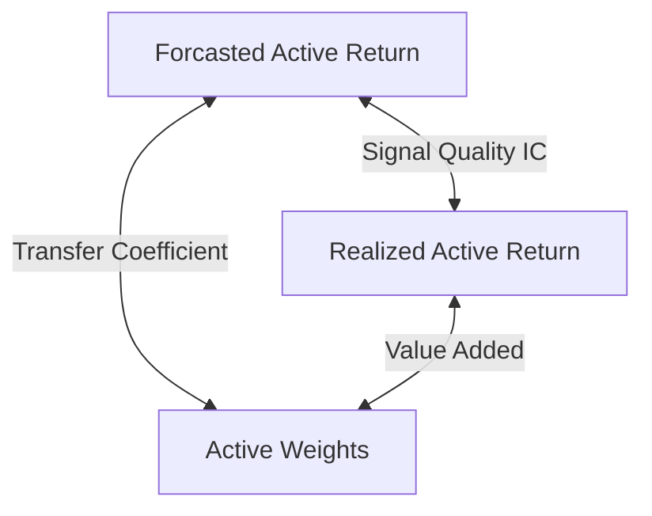

<ndtag category="CFA II" tag="Portfolio" createdate="2025-08-24" editdate="2025-08-27"></ndtag>

### <!-- C1 p423 --> Exchange-Traded Funds: Mechanics and Applications
#### Mechanics of ETFs
* open-end fund: flexible fund shares
* closed-end fund: fixed fund shares

ETF is an open-end fund
* primary market: created or redeemed in kind (实物申购赎回), in a shares-for-shares swap
  * between authorized participants (APs) and ETF issuer
  * AP: brokers/dealers
  * creation units: usually 50,000 shares
* secondary market: AP as broker or dealer
  * US: central settlement
  * European: fragmented settlement and wider spread

Net Asset Value (NAV) ≈ price

#### Costs and Risks of ETFs
##### Trading Costs
* bid ask spread
* ETF premium: (price - NAV) / NAV
  * iNAV (indicated NAV, intraday fair value)
  * time differences, NAV calculated on underlying securities' last price
  * liquidity difference between ETF and underlying securities

##### Tracking Error
index tracking ETFs dominate ETF markets
tracking error: standard deviation of differences of return
sources:
* fees and expenses
* representative sampling and optimization: some underlying is illiquid
* depositary receipts and other ETFs: depositary receipts may have better liquidity and thus difference of price
* index change
* fund accounting practices: different valuation between index and ETF (such as suspended stock)
* regulatory and tax
* asset manager operations
  * security lending or foreign dividend recapture could enchance ETFs income, but not accounted in the index

##### Tax Issues
tax fairness: 
* mutual fund: capital gain charge is distributed to remaining shareholders, if someone sells
* ETFs does not occur tax on redemption in kind

tax efficiency: ETF manager choose shares with the largest unrealized capital gains for redemption, reducing potential capital in the fund
some ETFs may have share classes that reinvest dividends

##### Other Costs and Risks of Owning ETFs
ETFs charge lower fees than mutual fund:
* less research cost
* less sales cost

round-trip trading cost = 2 × (one-way commission + 0.5 × bid ask spread)
Risk of ETFs:
* settlement risk: underlying derivatives
* security lending: low counterparty default risk

#### ETFs in Portfolio Management
* portfolio liquidity management: ETFs can be used to invest excess cash quickly
* portfolio rebalancing
* portfolio completion strategies
* transition management: maintain exposure in the absence of manager
* active and factor investing

for large asset owners:
* separately managed account (SMA): lower fees
* ETF holdings is disclosed

### <!-- C2 p471 --> Using Multifactor Models
#### Arbitrage Pricing Theory
##### CAPM
SML (security market line): relationship between return and beta

##### Arbitrage Pricing Model
$E(R_p)=R_f+\sum \beta_i\lambda_i$
* $\beta_i$: sensitity of portfolio to factor i
* $\lambda_i$: expected/factor risk premium
* pure factor portfolio: portfolio only contains one factor
* lambda is also risk premium for a pure factor portfolio

assumptions:
* a factor model describes asset return
* investors can diversify and eliminate asset-specific risk
* no arbitrage opportunities exist among well-diversified portfolios

##### Arbitrage Opportunity
Jensen's alpha: $R_p-E(R_p)=R_p-[R_f+\beta(R_M-R_f)]$

#### Multifactor Models
##### Structure of Multifactor Models
* Macroeconomic Factor Model: $R_p=E(R_p)+\sum\beta_iF_i+\varepsilon_p$
  * $F_i$: surprise (unexpected change) in macro variables
* Fundamental Factor Model: $R_p=a_p+\sum\beta_iF_i+\varepsilon_p$
  * $F_i$: return associated with factor i
  * $\beta_i=\frac{X_{ki}-\overline{X_{k}}}{\sigma(X_k)}$: standardized beta of attributes k of the asset i
  * fundamental factor: P/B ratio, P/E ratio, explaining cross-sectional differences
* Statistical Factor Model
  * less assumptions, lower interpretability

##### Comparison between Models
##### Applications of Multifactor Models
###### Return Attribution
active return relative to benchmark: $R_P-R_B$
active return = factor return + security selection return
* return from factor tilts: reflect skill in asset class selection
* return from security selection: reflect skill in individual asset selection

factor return = $\sum(\beta_i^P-\beta_i^B)F_i$

###### Risk Attribution
active risk: $\sigma(R_P-R_B)$
information ratio: $\frac{R_P-R_B}{\sigma(R_P-R_B)}$
active risk squared = active factor risk + active specific risk

###### Portfolio Construction and Decisions
Carhar Model: $E(R_p)=R_f+\beta_1RMRF+\beta_2SMB+\beta_3HML+\beta_4WML$
* WML: winner minus loser, momentum factor

### <!-- C3 p519 --> Measuring and Managing Market Risk
#### ! Value at Risk
##### Definition
A traditional stock and bond portfolio focus on monthly or quarterly VaR

##### Methods to Estimate VaR
* Parametric (Variance-Covariance Method)
  * $VaR=E(R)-z_\alpha\sigma$
* Historical Simulation Method
  * if data in the lookback period is more volatile, VaR will be over-estimate
* Monte Carlo Simulation Method

##### Extensions of VaR
* Conditional VaR (CVaR)
* Incremental VaR (IVaR): VaR change if portfolio size change
* Marginal VaR (MVaR): change of VaR with small change of a security position
* relative VaR: ex ante tracking estimate on active return

#### Other Risk Measures
* Sensitivity Risk Measures: partial derivative
* Scenario Risk Measures: scenario analysis
  * historical/hypothetical

#### Choices of Risk Measures
* banks:
  * liquidity gap
  * economic capital
  * VaR
  * leverage risk measures
* asset manager
  * redemption risk
* hedge fund
  * drawdown
* pension fund
  * interest rate risk
  * surplus at risk

#### Managing Market Risk
* risk budgeting 
* capital allocation
* position limits
* scenario limits
* stop-loss limits

### <!-- C4 p589 --> Backtesting and Simulation
#### Backtesting 
sortino ratio: $\frac{R_p-R_f}{\sigma_-}$
survivorship bias is actually a type of look-ahead bias.
data snooping: selects data until a significant result is found, also called "p-hacking"

#### Simulation
historical simulation: select returns at random from history without time order

### <!-- C5 p17 --> Economics and Investment Markets
#### Framework for Analysis
discounted cash flow model with suitable discount rate

#### Discount Rate
##### Real Default-Free Rate of Return
Inter-temporal rate of substituion (ITRS): $m_t=\frac{U_t}{U_0}$
* $U_t$: marginal utility of future consumption
* $U_0$: marginal utility of current consumption
* $m_t<1$, $m_t$ is lower if economy state is better
* zero coupon, inflation indexed, risk free bond with par 1, the price should be $m_t$.
* $l=\frac{1}{m_t}-1$
real risk free rate is positively related to GDP.
real risk free rate is positively related to volatility of growth rate (marginal utility of expected payoff is lower with higher uncertainty).

##### Infaltion Premium
short-term nominal default ree interest rate (T-bills): $1+l+\theta$, $\theta$ is expected inflation rate
for long term: $1+l+\theta+\pi$, $\pi$ is risk premium for uncertainty about actual inflation
Break-even Inflation Rate (BEI): $\text{BEI}=\theta+\pi$

Taylor Rule: targeted short term rate: $R=(R_\text{neutral}+\theta)+\frac{1}{2}(\theta-\theta^*)+\frac{1}{2}(Y-Y^*)$
* $R_\text{neutral}+\theta$: neutral real rate
* $\theta$ current inflation and $\theta^*$ target inflation
* $Y$ current growth of real GDP and $Y^*$ growth of real GDP

slope of yield curve:
* during recession, slope of yield curve will increase
  * investor expect higher future GDP grwoth and higher long-term rates
  * central bank tends to lower the policy rate

##### Credit Premium
credit spread: $1+l+\theta+\pi+\gamma$

##### Equity Risk Premium
equity risk premium: $1+l+\theta+\pi+\lambda$
equity risk premium relative to credit risky bonds: $1+l+\theta+\pi+\gamma+\kappa$
consumption-hedging property: high payoff during economic downturns
* consumption-hedging property for equities are poor, thus demanding high risk premium

investment strategy:
* value strategy performs well during recession
* growth stategy performs well during expansion
* small capital size stock tends to underperform large-cap stocks
* rotation strategy

##### Liquidity Premium
liquidity premium: $1+l+\theta+\pi+\gamma+\kappa+\phi$

### <!-- C6 p103 --> Analysis of Active Portfolio Management
#### Value Added by Active Management
value added (active return): $R_A = R_P-R_B$

##### Active Weights
$R_A = \sum \Delta w_iR_i=\sum w_i(R_i-R_B)$

##### Decomposition of Value Added
$R_A = \sum w_i^PR_i^P - \sum w_i^BR_i^B=\sum(w_i^P-w_i^B)R_i^B+\sum w_i^P(R_i^P-R_i^B)$
* $\sum(w_i^P-w_i^B)R_i^B$: active asset allocation
* $\sum w_i^P(R_i^P-R_i^B)$: security selection

#### Information Ratio
##### Sharpe Ratio and Information Ratio
Treynor Ratio: $\frac{R_p-R_f}{\beta_p}$
$IR_P=\frac{R_A}{\sigma_A}$
* not affected by taking positions in benchmark portfolio [ $tR_p+(1-t)R_B$ ]
* not affected by active weight [ $t(w_i^P-w_i^B)+w_i^B$ ]
* affected by cash or use of leverage

##### Construct Optimal Portfolio
The optimal portfolio will be contructed if $SR_p^2=SR_B^2+IR^2$
* higher IR, higher SR

for unconstrained portfolios, the level of active risk that leads to the optimal result $\sigma_A^*=\frac{IR}{SR_B}\sigma_B$

#### The Fundamental Law
##### The Correlation Triangle

Signal quality is measured by forecasted active return $\mu_i$ and realized active return $R_i^A$: $IC$
correlation between active weights and forecasted active return called TC
* measures the degree to which investor's forecasts are translated into active weights

##### Basic and Full Fundamental Law
Breadth (BR): number of independent active decisions per year
* indicator of how much efforts the manager has put into 
* transaction number = f(TC,BR)

* basic fundamental law: $IR = IC \times\sqrt{BR}$
* full fundamental law: $IR = TC\times IC \times\sqrt{BR}$

The optimal portfolio will be contructed if $SR_p^2=SR_B^2+(TC\times IR)^2$
for unconstrained portfolios, the level of active risk that leads to the optimal result $\sigma_A^*=\frac{TC\times IR}{SR_B}\sigma_B$

##### Application of the Fundamental Law
IC = 2 × (correct rate) - 1
$E(R_A|IC_{\text{realized}})=TC\times IC_{\text{realized}}\times\sqrt{BR}\times \sigma_A$
$R_A =E(R_A|IC_{\text{realized}})+\varepsilon$
active return variance could be decomposited into two parts:
* varaition due to realized IC (TC^2)
* variation due to constraint-included noise (1 - TC^2)