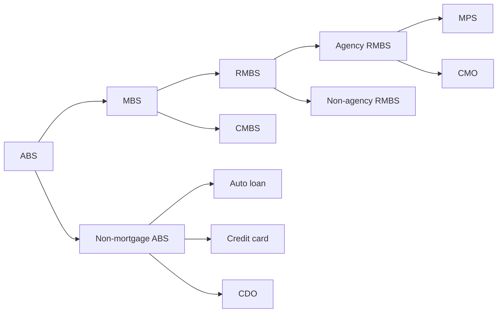

<ndtag category = "FRM II" editdate="2024-10-30" createdate="2024-10-21" tag="Risk-Management"></ndtag>

### <!-- 1. C1 p15 --> Fundamentals of Credit Risk
#### What is Credit Risk
Insolvency: asset less than liability

#### Transactions and Entities
loaned money, lease obligation, receivables, prepayment for goods or services.
deposits, claim or contingent claim, derivative

##### Entities Exposed to Credit Risk
###### Financial Institutions
Banks: extend credit
Asset managers: debt credit risk
Hedge Funds: funds view the probability of an entity defaulting as an opportunity to deploy capital.
Insurance Companies: underwriting activities (for loans), investment portfolio and reinsurance recoverables
Pension funds: credit risky assets

###### Corporates
account receivables
derivative trading activities
supply chain

###### Individuals
deposit, investment activity

### <!-- 2. C2 p25 --> Governance
#### The Three Lines of Defense
1. business owners: primarily own and manage risk
2. risk management, compliance and legal: monitors and oversees risk 
3. internal audit, external auditors and special audit committees: independent assurance of the risk management

#### Guidelines
also called credit policies or risk management standards
CRO
breach of guidelines: immediate termination of employment

#### Skill
##### Delegation of Authority
Credit committees: highest level approval
###### Risk Parameters
exposure, credit quality and tenor

#### Limit
the maximum loss to withstand

#### Oversight
compensation should never be based on profitability of the business
CRO reports directly to CEO and has pribileged access to risk committee
near business operation departments

### <!-- 3. C5 p57 --> Introduction to Credit Risk Modeling and Assessment
#### Development
regulatory: capital adequacy ratio
analytical: CAMEL (capital adequacy, asset quality, management, earnings and liquidity)

##### Regulatory Framework
Basel I: simplistic guidelines for credit risk
Basel II: credit risk, operational and market risk
Basel III: more strict capital requirement and liquidity

##### Analytical Methods
CAMELS (sensitivity): 1-5 points, and 1 is best

#### Credit Risk Assessment Approaches
##### Quantitative Measurement
expected loss (EL): $EL=PD\times EAD\times LGD$
* probability of default：  usually set to be one year
* Exposure at default:
* Loss given default: recovery rate = 1 - LGD

##### Types
###### Judgmental Approaches
also called expert systems or qualitative approaches
5C Analysis: character (personality), capacity (ability to repay the loan), capital, collateral, conditions (business environment)
###### Data-Driven Empirical Models
to find relationship between default and input varaibles
###### Financial Models
structural model: default is endogenous process 
reduced form models: default is exogenous random variable

### <!-- 4. C6 p71, C9 p119 --> Credit Rating
#### External Ratings
##### Credit Scoring System to Credit Rating System
data-driven method
Credit Scoring: automated analytical numerical score
Credit rating: combination of analytical and judgemental assessments

###### External Models
rating agencies such as Moody's, S&P and Fitch

###### Through the Cycle vs. Point in Time
* Through the Cycle: long-term orientation covering at least one business cycle
  less frequency, most agencies use
* Point in Time: timely update for new information

##### Development Process
data → model fitting → validation → definition and validation of ratings → implementation, monitoring and review

##### Credit Rating Agencies
See <a href="https://rfmeng.github.io/pages/CFA%20I/CFA%20I%20-%20Fixed%20Income%20(2).html#nav2.3" target="_blank">here</a>, mostly for long-term credit ratings. 
D is for already defaulted.

###### Criticism
1. lack of transparency and accountability, conflict of interest
2. promoting debt explosion
3. poor predictive ability
4. pro-cyclicality

#### Internal Ratings
##### Altman Z-Score Model
linear discriminant analysis
$Z=1.21x_1+1.4x_2+3.30x_3+0.6x_4+0.999x_5$
* $x_1$: working capital / total assets
* $x_2$: retained earnings / total assets
* $x_3$: EBIT / total assets
* $x_4$: market value of equity / book value of liability
* $x_5$: sales / total assets

higher than 3 is impossible to default, lower than 1.8 very possible.

#### Probability of Default
##### Definitions Related to Probability of Default
Cumulative default probability: P(issuer default in three years)
Marginal default probability (unconditional/joint): P(issuer default in third year)
Conditional PD: P(default in third year | survive in the second year)
$(1-\bar{d})^3=(1-d_1)(1-d_2)(1-d_3)$, where $d$ is conditional PD

###### Survival Effect and Mean-Reversion Effect
For investment-grade bonds, the marginal probability increases with time while speculative-grade bonds' decreases with time.

##### Migration Matrix
NR is for not rated.

##### Recovery Rate and Default Rate
LGD = 1 - RR (Recovery rate)
recovery rate is negatively related to PD

### <!-- 5. C9 p119, C12 p157 --> Estimating Default Probabilities from Credit Spreads
#### Using Hazard Rate to Estimate Default Probabilities
##### Default Intensity Model
under exponential distribution, no default within $t$ is $P(X=0)=e^{-\bar{\lambda}t}$.
$\lambda$ is conditional default probability at $dt$ and $\bar{\lambda}$ is 

#### Spread and Hazard Rate
##### Using Spread to Estimate Hazard Rate
$\bar{\lambda}(T)(1-RR)=s(T)$, expected loss = extra profit
* $\bar{\lambda}(T)$: hazard rate in $T$
* $RR$: recovery rate
* $s(T)$: credit spread in $T$

##### Credit Spreads
###### CDS Spread
pay CDS spread and receive principal insurance

###### Bond Yield Spread
bond yield spread = YTM - risk free rate
Bond's liquity is not as good as CDS
risky bond + CDS = risk-free bond
* CDS-bond basis: CDS spread - bond yield spread
  CDS-bond basis is very negative during crisis
  if the bond is cheaper than par, the basis tend to be positive (bond is sold and  CDS is bought)

###### Asset Swap Spread
pays coupon on the bond, receives floating reference rate plus asset swap spread.
(?) coupon payer of the swap should pay the opponent the discounted price part: if bond price is 95 for 100 par value, 5 should be paid.
* (-) Suppose risk-free rate is 5% and coupon rate is 5%. If the bond is risk-free, price should be equal to bar. Coupon paid is 5% and swap spread is 0. If the bond has higher yield 10%, namely, has implicit credit risk. Then the trade 5% coupon for 5% risk-free rate plus 5% spread is unfair. Another 5% should be paid at the beginning.

##### Matching Bond Prices
match expected loss at different time point, recovery part does not need to be discounted at default.

#### Comparison of Default Probability Estimates
##### PD from Historical Data vs. from Credit Spread
the PD from credit spread is higher, the difference between the two hazard rates tend to grow as credit quality declines
The nonsystematic risk of bond is difficult to diversify, the bond return is limited upside.

##### Real-World and Risk-Neutral Default Probabilities

### <!-- 6. C5 p57, C9 p119 --> Estimating Default Probabilities from Equity Prices
#### Merton Model
##### Assumption
assume firm with simple debt structure, consisting of a zero-coupon bond matured at T.
##### Credit Risk as Option 
payoff of equity value is $\max\{E_T-F,0\}$, where $F$ is repayment required on debt.
For equity price, $E_0=V_0N(d_1)-Fe^{-rT}N(d_2)$, $PD=1-N(d_2)$.

##### Distance to Default
$d_2$ is called DtD or DD
asset = equity + debt
(?) To solve unobserved $V_0$ and $\sigma_V$, we could solve BSM and $N(d_1)V_0\sigma_V=E_0\sigma_E$. The equality holds because of $\sigma$ is volatility for return rate and $N(d_1)=\frac{\Delta E}{\Delta V}$.

##### Limitations of Merton Model
applicable only to liquid, publicly traded company
rely on static and simple capital structure

#### KMV Model
Real-world PD: $d_2=\frac{\ln V_0-\ln F+(\mu-\frac{1}{2}\sigma_V^2)T}{\sigma_V\sqrt{T}}$
Risk-neutral PD is higher than real-world PD

##### Extension of Merton Model
Moody's KMV Expected Default Frequency (EDF) model and Kamakura: transform risk-neutral PD to real-world PD, find the map between DtD and real-world PD.
The default threshold: function of short-term debt and long-term debt.

If $\mu$ is given, use $\mu$.

### <!-- 7. C7 83 --> Credit Scoring and Retail Credit Risk Management
#### Retail Credit Risk
##### Basel's Definition of Retail Exposures
home mortgages: loan to value ratio
home equity loan (home equity line of credit, HELOC): hybrid between a consumer loan and a mortgage loan, secured by residential properties
installment loan: revolving loan, such as credit card
small business line
##### Retail Credit Risk vs. Corporate Credit Risk
* retail credit risk: default by a single consumer is not expensive, expected loss could be built into price
* Corporate credit risk: concentrations of exposures

##### Dark Side of Retail Credit Risk
1. not all innovative retail credit products have enough historical data
2. the security will change under different economic environment
3. the tendency to default is complex product of social and legal system
4. operational issue affects the credit assessment

##### From Default Risk to Customer value
risk based pricing

#### Credit Scoring
##### Types of Credit Score Model
* Credit Bureau Scores: known as FICO scores, developed by Fair Isaac Corporation
* Pooled models: similar strategy for customers with similar credit portfolio, tailored to industry
* Custom models

##### Key Variables in Mortgage Credit Assessment
debt-to-income ratio, FICO, loan-to-value ratio

#### From Cutoff Scores to Default Rates and Loss Rates

##### Measuring the Performance of Scorecard
cumulative accuracy profile (CAP), consider fraction of default found and ranked scores
$\text{accuracy ratio} = \frac{\text{area under actual model }}{\text{area under perfect model}}$, where the area should deduct the random model triangle area.
diagonal line corresponds to a random model

### <!-- 8. C8 97 --> Country Risk
#### Source of Country Risk
##### Life Cycle
developing country more risk, mature markets have more stable GDP growth.

##### Economic Structure
dependency on specific area of economics will cause the economy more unstable

##### Political Risk
authoritarian governments create discontinuous risk, democratic governments create continuous risk
corruption
physical violence
nationalization or expropriation risk

##### Legal Risk

##### Composite Risk Measure

#### Sovereign Country Risk
##### Sovereign Debt
###### Foreign Currency Defaults
It is more likely to default on bank debt than official debt, from history. Latin American accounts for a large part for soverign default.
Countries have shifted more towards local currency defaults, under domestic law, because of the speedier restructure than break the international law.
Tradeoff between inflation (print more money to pay the debt) and default.
###### Consequence of Sovereign Default Risk
reputation, capital market, real output, political instability, trade retaliation

###### Factors Determining Sovereign Default Risk
* debt to GDP
* pensions/social service commitment
* revenue (tax)
* political risk
* implicit guarantees: help from rich member countries

##### Sovereign Credit Rating
the ratings are sticky
to private creditors and not to official creditors
the difference between foreign and local soverign rating results from the independence of monetary policy

##### Soverign Default Spread
there has to be a default free security in the currency
little evidence that CDS spread is superior to market spread

### <!-- 9. C4 47 --> Credit Loss Distribution
$\text{Credit VaR}=WCL-EL$, where WCL is worst case loss at the given confidence level and EL is expected loss

#### Expected Loss and Unexpected Loss
$EL=PD\times EAD \times LGD$, where LGD is also called loss rate (LR).

##### Unexpected Loss
! Unexpected is standard deviation of credit loss
$UL_i=EAD_i\times\sqrt{PD_i\times\sigma_{i,LGD}^2+LGD_i^2\times\sigma_{i,PD}^2}$
$\sigma_{PD}^2=PD\times(1-PD)$

##### Portfolio EL and UL
$EL_p=\sum EL_i=\sum EAD_i\times PD_i\times LGD_i$
$UL_p\leq \sum UL_i$

###### Unexpected Loss Contribution
$ULC_i=\frac{UL_i\sum_j UL_j\rho_{ij}}{UL_p}$

For large $n$, $ULC_i= UL_i\sqrt{\rho}$

#### Credit Loss Distribution and Capital
##### Derive Economic Capital for Credit Risk
confidence level corresponds to bank's target credit rating
$EC_p=UL_p\times CM$, where EC is economic capital, CM is capital multiplier

##### Credit Loss Distribution
highly skewed, upward limited
beta distribution is recommended

##### Problems with the Quantification of Credit Risk
the credits are illiquid assets
ignoring multi-period nature of credits

### <!-- 10. C10 135, C11 145, C12 157 --> Default Correlation and Credit VaR
#### Default Correlation
joint probability that both firms will default is $\pi_{12}$
$\rho=\frac{\pi_{12}-\pi_1\pi_2}{\sqrt{\pi_1(1-\pi_1)}\sqrt{\pi_2(1-\pi_2)}}$

##### Drawbacks of Default Correlation
joint default is relatively rare event
small correlations have large impact
computationally intensive

#### Credit VaR
some consider only losses from defaults, others also consider downgrade or credit spread changes

##### Credit VaR vs. Market VaR
horizon for credit VaR is 1 year, and for market VaR 1 day

##### Default Correlation and Credit VaR

##### The Effect of Granularity on Credit VaR
Granular: cotains more independent credits, each of which is a smaller fraction of the portfolio
For a given default probability, credit VaR decreases as the credit portfilio becomes more granular. (?) The convergence is more drastic with a high default probability. 
* (-) Higher PD, higher EL, higher VaR.
If portfolio contains a very large number of independent small positions, the credit VaR tends to be 0.

### <!-- 11. C10 135, C11 145, C12 157 --> Regulatory Capital
#### Single Factor Model
##### Gaussian Copula Model for Time to Default
define $t_1$ as the time to default of company 1.
$a_1=N^{-1}(Q_1(t_1))$, where $Q_1$ is cdf of $t_1$.

##### Model Description
$a_i=\beta_i m +\sqrt{1-\beta_i^2}\varepsilon_i$, where $m$ and $\varepsilon_i$ are independent standard normal.
The default behavior $X_i=a_i$ is divided into two parts, $\beta_i\in [-1,1]$ with market and the residual idiosyncratic risk.
$\rho_{i,j}=\beta_i\beta_j$, which reduce the number of pairwise correlation from $C_n^2$ to $n$.

##### Unconditional Default Distribution
Assume $\beta_i=\beta$ for all $i$, which implies PD is same for all companies.

##### Conditional Default Distribution
conditional on market situation $\bar{m}$, default happens if $a_i$ lower than some threshold $K$.
$a_i$ fllows $N(\beta\bar{m},1-\beta^2)$

#### Vasicek Model
Basel II internal-ratings-based's (IRB) target: find a conditional PD on the 99.9% worst case market senerio.

##### Worst Case Default Rate
$a_i=\sqrt{\rho} \bar{m} +\sqrt{1-\rho}\varepsilon_i$
default rate conditional on $\bar{m}$: $N(\frac{N^{-1}(PD)-\sqrt{\rho}\bar{m}}{\sqrt{1-\rho}})$
99.9% percentile worst case PD $WCDR = N(\frac{N^{-1}(PD)-\sqrt{\rho}N^{-1}(0.001)}{\sqrt{1-\rho}})$
capital requriement/credit VaR: $(WCDR-PD)\times EAD \times LGD$
only one 99.9% confidence level participates in the standard, just for market factor $m$
$\rho$ is called correlation parameter.

##### Regulatory Capital
if maturity is longer than 1 year, credit quality decrease but not default might happen, this shoudld be multiplied by a maturity adjustment factor (MA).

###### Basel II
$\rho$ is given

### <!-- 12. C4 47, C5 57, C10 135, C12 157 --> Economic Capital
#### Creditmetrics
##### Rating Transition Matrices
based on historical data
ratings momentum: a company downgraded recently is more likely to be downgraded again.
0.5 year transition matrices is square root

##### Credit VaR
###### Sampling and Correlation Model
use correlation of equity return as correlation of transition probability.

##### Credit Spread Risk
Historical simulation presents survivor bias: if company is alive today, it did not default in the past and no default in future.

###### Constant Level of Risk Assumptions
reblance: sell the rating changed bond and buy a new BBB bond every month.

#### Credit Risk Plus
$n$ loans and $m$ will default, the defaults are independent to each other.
If $q$ is small and $n$ is large, the distribution converges to Poisson.
The convergence exists even if the PD are different, an average is converged.
Assume default number follows Gamma, the default number follows negative binomial.
If default number has 0 std, there is no default correlation.
As $\sigma$ increases, the probability $q_n$ has higher volatility, large number and small number of defaults are more likely to happen, thus higher correlation.

### <!-- 13. C12 157, C14 183 --> Derivatives
#### Derivatives Market
small number of large counterparties

##### Counterparty Credit Risk
##### Clearing
otc derivatives could be centrally cleared

##### Market Participants
* large player: large global banks, called dealer.
  need to be a member to participate in CCP clearing
* End user: corporate, sovereign, financial institutions
  directional position and unwilling to commit to margining or posting collateral

##### Collateralization
most products are OTC traded.

* centrally cleared: daily collateralization in cash
* collateralized: bilateral derivatives
* uncollateralized: one of the parties is end user

###### Banks and End Users
end user hedge on a one-for-one (order) basis rather than macro basis.

##### ISDA 
The International Swaps and Derivatives Association

###### ISDA Master Agreement
market standard, to remove legal uncertainties
all transactions referenced are combined into a single net obligation.
default events:
* credit support default
* misrepresentation
* bankruptcy
* merger without assumption (new party merge one party and does not follow obligation)

loss for the party should be net value of derivative and collateral

#### CCP and Modeling Derivatives Risk
##### Historical Ways
* SPV (special purpose vehicle/entity, or SPE)
* derivatives product companies: generally AAA rated
  DPC's fate interacts with parent company
* monolines and CDPCs: extension of DPC, mostly for credit derivative

##### Central Clearing of OTC Derivatives
initial margin is above the variation margin
default fund: from CCP's member to avoid systemic risk
CCP absorbs the domino effect (as a buffer for systemic risk)

##### Derivatives Risk Modelling
VaR, ES

### <!-- 14. C15 207 --> Counterparty Risk
only one party takes lending risk while counterparty risk is typically bilateral

#### Settlement, Pre-Settlement and Margin Period of Risk
settlement risk: due to timing difference
margin period of risk: blank time window between margin call and margin received, there is not enough margin
pre-settlement risk: so called counterparty risk

#### Mitigations of Counterparty Risk
netting
collateral
hedging: CDS
other contractual clauses

### <!-- 15. C16 221, C17 239 --> Netting Close-out and Related Aspects
#### Cashflow Netting
payment netting: reduce time and cost associated with making payment
reduce operational risk, counterparty risk and liquidity risk

##### Currency Netting and CLS
Non-deliverable forward (NDF) transaction: currency is cash-settled based on the NDF rate and the prevailing FX rate.

###### Continuous Linked Settlement (CLS)
payent versus payment: only after both currencies have arrived does CLS Bank make the outgoing payment to both parties.

##### Multilateral Netting
###### Clearing Rings
multilateral netting before the development of central clearing
Portfolio Compression: minimize gross notional of positions in the market

###### Compression Algorithm
participants can specify constraints 
total notional could be choosed as minimized target, alternative choices could be squared notinal or total number of positions

#### Value Netting
##### Close-out Netting
when a party defaults, close-out netting aims at a timely termination and settlement of the net value of all transactions
* close-out: the right to terminate transactions and cease any contractual payment
* netting: the right to offset value across transactions

if the survivor party is owed money, it could initiate a bankruptcy claim, jumping to bankruptcy queue for net value

###### Close-out Netting and ISDA
close-out netting reduces counterparty risk (pre-settlement risk)
to determine a close-out amount, use value or data offered by third party

##### Set-off
netting across product categories (loan and interest rate swap cannot set-off under default)

##### Impact of Netting
* (?) netted positions are inherently more volatile
* if credit exposures were driven by gross positions, trading with the troubled counterparty would have strong incentives to attempt to terminate
* netting redistributes value to OTC derivative creditors from other creditors

##### Multilateral Netting and Bifurcation
bifurcation: some products are clearable but others are not
partial central clearing (for only subset of trades) might not compress exposure as CCP

##### Additional Termination Event
credit quality deteriorating
tricker: rating downgrade, low market capitalization, low net value
clause: provide a replacement counterparty, provide more margin, offer third-party guarantee
potential danger:
* cliff-edge effect: single notch rating downgrade might cause a dramatic consequence

### <!-- 16. C17 239 --> Margin
#### Margin Terms
##### Rationale for Collateral
reduce counterparty risk
counterparty risk in theory can be completely neutralized under sufficient amount of margin.

##### Variation Margin
Margin period of risk (MPoR): effective delay in receiving margin

##### Initial Margin
called Independent amount in OTC market: extra margin that must be posted independently from the value of derivative
It reflects potential future exposure. (eg. 99% confidence over 10 days interval)

##### OTC Derivatives Market
For bilateral OTC derivatives, initial margin has been quite rare.
uncleared margin requirement (UMR): regulators have started to impose bilateral margin requirements, which aligning cost to CCP clearing.

##### Credit Support Annex (CSA)
* No CSA: end user
* Two-way CSA (mostly): two financial counterparties
* One-way CSA: one party receive collateral

##### Margin Terms
* Threshold
  amount below which margin is not required, leading to undercollateralization.
Threshold less than 0: post initial margin
* Minimum Transfer Amount
  smallest amount of margin that can be transfered
* Rounding
  post more and extract less
* Credit Support Amount: variation margin

##### Margin Types and Haiccuts
haircuts: discount to the value of collateral to avoid security sold at a lower price

#### Impact of Margin
##### Valuation Agent
reconsiliation the dispute

##### Impact of Margin on Exposure
margin does not reduce risk, it merely redistributes it. Other creditors will be more exposed.

##### Rehypothecation and Segregation
Rehypothecation: reuse of variation margin by the margin receiver, used as margin for another trade.This reduces the total amount of collateral in the market.
Segregation: for initial margin

##### Potential Problems of Margin
* Liquidity risk
  the non-defaulting party faces transaction costs and market volatility under default
* legal risk
  Rehypothecation and Segregation
* FX risk
* operational risk: non-standardized margin
* funding liquidity risk
  
### <!-- 17. C18 269 --> Central Clearing
#### Evolution and Mechanics
##### Evolution of Complete Clearing
client clearing: client should participate clearing through CCP member
bilateral trades: CCP is not suitabe for all products
multiple CCPs: regional and product

##### Novation
CCP steps in a transaction and acts as an insurer of counter party risk in both directions
portfolio compression: cashflow netting and acceptance of another party to pay
CCP compress risk

#### CCP Risk Management
##### Functions of CCP
* multilateral offset: netting
* loss absorbency
* default management: allocating loss, auctioning the default trade

##### CCP Membership Requirements
creditworthiness, liquidity, operationality (ability to adhere to CCP rules)

##### Margin and Default Funds
variation margin on a daily basis and must be cash
initial margin
default funds: CCP members all contribute to and loss mutualization
In general, initial margin is higher than default fund
If initial margin is lower than default fund, client tends to take use of default funds (moral hazard). The remaining trade's portability (The other side does not default) is low.

##### Default Scenarios and Margin Period of Risk
macro-hedging
auction
fire drills: default exercise
driving test: test new member

##### The Loss Waterfall
initial margin of defaulter → default fund of defaulter → (equity contribution from CCP) → default fund of non-defaulting member → rights of assessment / other loss allocation methods → remaining CCP capital → liquidity suport or CCP fails

other methods:
1. rights of assessment: additional default fund
2. variation margin gains haircutting
3. tear-up: break the matched book
4. forced allocation 
  
##### Disadvantages of Central Clearing
moral hazard, adverse selection, bifurcation, procyclicality (higher margin requirement during crisis)

### <!-- 18. C19 287 --> Future Value and Exposure
#### Metrics for Credit Exposure
##### Credit Exposure
$\text{Credit Exposure}=\max\{\text{value},0\}$
shorting options has 0 credit exposure

* Expected Future Value (EFV)
* Potential Future Exposure: equivalent measure to VaR
* Expected Positive Exposure (Expected Exposure): $E(\max(0,\text{exposure}))$
* Expected Negative Exposure
* Average EPE (Loan Equivalent): average EPE across all time horizons

#### Exposure Profile of Various Securities
##### Bond and Loans
exposure for loan may decline with time because of possibility of prepayment
##### Forward
square root of time
##### Interest Rate Swap
peaked shape because of payment
##### Cross-Currency Swap Exposure
combination of IRS and FX forward: fixed rate in one currency and floating rate in anther currency
The contribution of FX forward is larger

##### Swaption
forward starting swap: forward
swaption: option on whether choose to enter a swap contract with strike
after strike date, EPE for swaption is smaller than forwad starting swap because it does not exercise on some paths.

##### Credit Derivatives
CDS's PFE: has a jump due to default

#### The Impacts on Exposure
##### Impact of Aggregation on Exposure
##### Impact of Margin
when exposure is negative, the margin is also negative (post margin rather than call margin)
collateralization is not a a perfect form of risk mitigation

##### Funding, Rehypothecation and Segregation
$\text{Funding}=\text{value}-\text{margin}$
if funding is positive, it is funding cost

###### Impact of Margin on Exposure and Funding
$\text{Positive Exposure}=\max\{\text{value}-VM-IM^R\}$, where $IM^R$ is intial margin received
$\text{Funding}=\max\{\text{value}-VM+IM^P\}$, where $IM^R$ is intial margin paid

### <!-- 19. C12 157, C15 207, C20 309  --> CVA
#### Credit Valuation Adjustment and xVA
CVA is expected loss from a default by the counterparty, $\text{Risky Value}=\text{Risk-free Value}-CVA$
motivation: volatility of credit spread, accounting and capital requirement

##### Credit Limit vs. CVA
a transaction with low profitability may be accepted because the existing limit credit is small
CVA: the counterparty risk becomes whether it is profitable, it defines a minimum revenue that should be achieved
Three levels to assessing the counterparty risk of transaction:
* trade level: CVA
* counterparty level: CVA (incorporating the impact of risk mitigants such as netting and margining)
* portfolio level: creidt limits

CVA encourages minimizing the number of counterparties, while credit limits encourage maximizing that number

##### xVA
economic costs of a derivative: funding, regulatory capital
* counterparty risk: CVA/DVA
* funding: FVA/MVA (initial margin)
* collateral: ColVA
* capital: KVA

#### CVA and DVA
##### Unilateral CVA (UCVA)
$UCVA\approx -LGD\times\sum d(t_i)\times EPE(t_i)\times PD(t_{i-1},t_i)$
* $d(t_i)$: discount factor
* $ PD(t_{i-1},t_i)$: marginal default probability
* assumes no wrong-way risk: PD and EPE does not affect each other

CVA as a spread, $UCVA\approx -\text{average EPE}\times \text{spread}$

##### Bilateral CVA (BCVA)
debt valuation adjustment (DVA)
$BCVA=CVA+DVA$
$CVA=-LGD_C\times\sum d(t_i)\times EPE(t_i)\times PD_C(t_{i-1},t_i)(1-PD_P(0,t_{i-1}))$
$DVA=-LGD_P\times\sum d(t_i)\times ENE(t_i)\times PD_P(t_{i-1},t_i)(1-PD_C(0,t_{i-1}))$
GARP use survival probability at the end of the period $1-PD_P(0,t_{i})$
$BCVA\approx -\text{average EPE}\times \text{spread}_C-\text{average ENE}\times \text{spread}_P$
weaker party would pay stronger party based on the difference in credit quality

##### Notice
when talking about the size of CVA and DVA, it is absolute value

#### CVA Allocation
##### Netting CVA
$CVA_{NS}\leq\sum CVA_i$, where $CVA_{NS}$ is the total CVA of all transactions under netting agreement, NS is for netting set
The netting effect on CVA can be significant

###### Incremental CVA
$CVA^{NS-NS*}=CVA^{NS*}-CVA^{NS}$
incremental EPE could be negative
incremental CVA less than or equal to standalone CVA

###### Marginal CVA
breakdown CVA

##### Impacts on CVA
in default, CVA may be 0

###### Spread Curve
Asumming same cumulative PD at the mid point, the marginal PD differs with spread curve sloping. 
Upward sloping shows largest CVA. (higher PD, larger EPE)

###### Variation Margin
MPoR/cure period: typicall 10 or 20 days.

#### Wrong-Way Risk
##### Definition of WWR and RWR
WWR: the exposure is high when counterpart is more likely to default and vice versa.

##### Examples of WWR and RWR
* option: underlying is highly correlated to the counterparty is WWR
  buying a put faces WWR
* FX forward: potential weakening of the currency and deterioration in credit quality of the counterparty
* interest rate swap: when economy is weak, interest rates would be likely to drop down
  fixed receiver faces WWR
* commodity swaps
* CDS: exposure at default will increase if credit spread is widening

##### WWR Modelling
hazzard rate approach: correlation between credit spread and EPE
structural: bivariate distribution
parametric approach: fit a given function
jump approaches: default of large corporation will result in FX rate decrease

##### Collateralization and WWR
WWR may be also present in terms of the relationship between margin and exposure
example: payer interest rate swap collateralized with a government bond

##### CCP and WWR
a large dealer reprensents more WWR than a smaller one, because a default from large dealer is more severe
under pressure, CCP tends to accept a wide range of eligible securities for initial margin, the clearing members has the incentive to post the greatest risk collateral (adverse selection).

### <!-- 20. C21 337  --> Stress Tresting
#### Evolution of CCR Management
The treatment of CCR as a market risk was developing, largely relegated to pricing in CVA
The financial institution would replace the trade with another counterparty before the default.

#### Stress Testing for Loan Portfolio
$EL=\sum PD_i\times LGD_i \times EAD_i$
$EL^S=\sum PD_i^S\times LGD_i \times EAD_i$, where $EL_S$ is expected loss under stress.
$\text{stress loss}= EL_S-EL$
PD is taken to be a function of other variables.

#### Stress Testing for Derivative Portfolio
$EL=\sum PD_i\times LGD_i \times \alpha \times \text{average EPE}_i$
$EL^S=\sum PD_i^S\times LGD_i \times \alpha \times \text{average EPE}_i^S$

#### Stress Testing for CVA
$CVA = \sum LGD_n\times\sum d(t_i)\times EPE_n(t_i)\times PD_n(t_{i-1},t_i)$
$CVA^S = \sum LGD_n\times\sum d(t_i)\times EPE_n^S(t_i)\times PD_n^S(t_{i-1},t_i)$

#### Pitfalls in Stress Testing CCR
hard to aggregate, because treatments for loan and derivate are different
nonlinear

### <!-- 21. C3 25  --> Credit Risk Management
#### Policies and Actions
##### Regulatory Policies to Limit Credit Risk
1. large exposure and concentration limits
   most countries impose single-customer exposure limit of 10-25 percent of capital
2. related-party financing: parent, shareholders, subsidiaries etc.
   total credit to related parties cannot exceed certain ratio to capital

##### Traditional Classification Categories
standard or pass, specially mentioned or watch, substandard, doubtful, loss
nonperforming loans analysis

#### Loan Loss Provisioning
bank's capacity to absorb losses:
1. provisions for possible loan losses
2. general loss reserves (Tier 2 capital)

##### IFRS 9 Implications
unexpected loss: VaR concept
Three stages:
1. all performing
   carry provisions calculated on 12-month expected loss
   interest: based on gross book value 
2. assets in arrears, or where a significant change in credit environment has occured
   provisions: based on lifetime expected loss
   interest: based on gross book value
3. nonperforming assets
   provisions: based on lifetime expected loss
   interest: based on net book value

##### Workout Procedure for Loss Assets
1. retaining loss assets and make remedy
2. writing off loss assets 

###### Workout Strategies
like AMC

##### Credit Risk Management Capacity
credit risk analysis
board of directors must ensure benefit for the bank

### <!-- 22. C9, C13, C14, C22 --> Credit Derivatives
#### Credit Default Swap
payment is the LGD part

##### CDS Spread
CDS spread times the notional amount directly
$\text{PV of expected payments}+\text{PV of accrual payments}=\text{PV of expected payoff}$
* expected payments: cumulative survival probability
* accrual payments: unconditional PD
* expected payoff: unconditional PD

##### Making to Market a CDS

##### CDS Indices
track credit default swap spreads
CDX: a portfolio of 125 investment grade companies in North America
iTraxx: a portfolio of 125 investment grade companies in Europe

##### The Use of Fixed Coupons
standardization of CDS payment is CDS coupon: 1% for investment grade and 5% for speculative grade
upfront premium: $(\text{CDS spread}-\text{CDS coupon})\times \text{duration}$, where duration is the total discounted PV part to be timed by CDS spread.
CDS price: $\text{upfront premium}\times100+\text{CDS price}=100$
buyer paid coupon for every survived company

##### CDS Forward and Options
If reference entity default before strike date, the contract expires.

##### Basket Credit Default Swaps
add-up basket CDS: provides payoff when any of the entity default
first-to-default CDS: provides payoff only when the first default occurs
kth-to-default: provides payoff only when the kth default occurs

#### TRS and CDO
##### Total Return Swap
exchange total return or any portfolio for a floating rate plus a spread
total return includes coupon and the gain or loss
The payer of TRS paid total return and the receiver receives total return.
The receiver undertakes credit risk of reference entity.
###### Financing Tool
It is equivalent to the payer loaned money to the receiver to buy the bond, but with much less counterparty risk.

##### Collateralized Debt Obiligations
CDO: an ABS where the underlying assets are bonds

###### Synthetic CDO
short CDS = long bond, with same maturity
the spread is earned on the undefaulted portion of the principal
single-tranche trading: an imaginary reference portfolio
standard synthetic CDO tranches: 
* 6 standard tranches of iTraxx cover losses in ranges 0-3%, 3-6%, 6-9%, 9-12%, 12-22%, 22-100%
* $\alpha_L$ is attachment point and $\alpha_H$ is detachment point

###### Valuation of a Synthetic CDO
$sA+sB=C$
* $A$: PV of expected payments
* $B$: PV of accrual payments
* $C$: PV of expected payoff

###### Implied Correlation
From structrued credit products to estimate a default correlation.
compound (tranche) correlation: from a tranche $\{\alpha_{q-1},\alpha_{q}\}$
base correlation: from expected loss from compound correlation for each tranche, then get base correlation from $\{\alpha_{0},\alpha_{q}\}$

###### Alternative Approaches to Estimate Default Correlation
from homogeneous model to heterogeneous model

### <!-- 23. C9, C13, C22, C23 --> Structured Credit Products
#### The Process of Securitization
##### Key Participants
* originator (sponsor, seller): often a bank
  from "buy and hold" model toward "originated to distribute"
* issuer (underwriter, arranger, SPV): 
  warehousing risk of assets
* rating agencyies: compensated by issuers
* servicers: collects and disburses principal and interest
* trustee and custodian

##### SPV Structures
amortizing structures: MBS, receives principal and interest periodically
revolving structures: principal collections are used to purchase new receivables
master trust: allow multiple securitizations to be issued from the same SPV

##### Reasons for Undertaking Securitization
For bank:
* SPV will be higher rated and provide a lower cost of funding
* gain cash flow to manage maturity mismatching
* balance sheet capital management

For investors: investing diversified loan pool, which they have no access to

#### Asset Pools
##### Classifications of Asset Pools
collateral loan
loan pool: even non-debt assets such as highway fee can be packaged into securitization
###### By Type of Pools
static pool: auto loan and residential mortgage
revolving pool: credit card debt
managed pool: CDOs

##### Auto Loan
prepayment speed is extremely stable
performance measure: cumulative loss and prepayment speed

##### Credit Card
delinquency ratio: delinquents (overdue for more than 90 days) / outstanding pool balance
default ratio: default / outstanding pool balance
monthly payment rate: collections / outstanding pool balance
outstanding balance is sum of current receivables and overdue receivables

##### Commercial Mortgage
debt service coverage ratio (DSCR) = net operating income / debt payments

##### Mortgage

#### Structured Products

Agency RMBS rarely has credit risk.
Mortgage pass-through securities (MPS): simply transfer interest and principal
Collateralized mortgage obligations (CMO): sequential pay, when a class received all principal repayments, it will be retired.
CMO has little credit risk, so the tranches are for prepayment risk.

##### Tranching
equity, mezzanine, senior have 5%, 10%, 85% respectively.
issuer usually buy the equity tranche

##### Credit Enhancement
overcollateralization: selling a par amount smaller than the underlying
excess spread (reserve) must be filled before equity tranche can receive money
margin step-up: late redeem should be compensated for higher coupon

##### Impact of PD and Default Correlation
Assume constant low correlation,
* equity presents positive convexity ($\frac{1}{x}$), and decreasing credit VaR
* mezzanine presents negative convexity for low PD and positive convexity for high PD ($\cos(x)$), and mixed change VaR
* senior presents negative convexity ($-x^2$), and increasing credit VaR

Assume constant PD,
* equity benefits from high correlation
* mezzanine benefits from high correlation when PD is high
* senior is hurt by high correlation
* all tranches credit VaR increases with high correlation

##### Default Sensitivities of the Tranches
Default 01: the impact of increase in 1 basis point in default probability

##### Risk Factors Impacting the Structured Products
systemic risk
tranche thinness

#### Cash Flows in Securitizaion Structure
##### Cash Waterfall
senior and mazzenine tranches have coupon and are called bond notes

##### Tracking Annual Cash Flows
cash inflow: interest + recovery amount
cash outflow: coupon
###### Overcollateralization Account
excess spread is diverted up to OC account anually, the extra part over maximum amount $K$ is distributed to equity tranche. Recovery portion is distributed to OC.
OC account's balance should gain risk free rate $r$
terminal available fund is for equity tranche

Example: CDO, with 100 identical loans with par value 1 million each. The loans pays 3.5% over Libor (5%). The maturity is 5 years. Senior tranche coupon is 50 bps over Libor, Mezzanine tranche is 500 bps over LIBOR. PD is 10%
| Yr | Def | Cum | Srv | Loan int | Exc spr | OC | Recov | OC+Recov | Eq flow | OC a/c |
| :---: | :---: | :---: | :---: | :---: | :---: | :---: | :---: | :---: | :---: | :---: |
| 1 | 10 | 10 | 90 | 7,650,000 | 1,975,000 | 1,750,000 | 4,000,000 | 5,750,000 | 225,000 | 5,750,000 |
| 2 | 9 | 19 | 81 | 6,885,000 | 1,210,000 | 1,210,000 | 3,600,000 | 4,810,000 | - | 10,847,500 |
| 3 | 8 | 27 | 73 | 6,205,000 | 530,000 | 530,000 | 3,200,000 | 3,730,000 | - | 15,119,875 |
| 4 | 7 | 34 | 66 | 5,610,000 | -65,000 | -65,000 | 2,800,000 | 2,735,000 | - | 18,610,869 |
| 5 | 7 | 41 | 59 | 64,015,000 |  |  | 2,800,000 | 2,800,000 | - | 19,541,412 |

###### The Negative Excess Spread
In the extrme cases, the inflow is not enough for outflow, the product pays all the inflow and ignores the insufficient portion.

