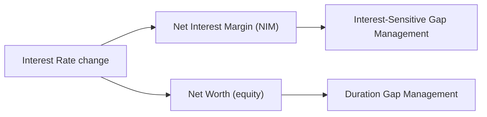

<ndtag category = "FRM II" editdate="2024-11-14" createdate="2024-11-06" tag="Risk-Management"></ndtag>

## A. Introduction of Liquidity Risk
### <!-- 1. C1 p15, C2 p31 --> Liquidity Risk and Leverage
#### Introduction of Liquidity Risk

solvency (偿付) vs. liquidity

##### Source of Liquidity Risk
Three types of liquidity risk interact.
* transaction liqudity (market liquidity)
* funding liquidity (balance sheet risk): finance assets at acceptable borrowing rate
* systemic risk

##### Measuring Market Liquidity
Market maker is also called dealer. It tends to increase bid ask spread above a certain size.
Expected transactions cost is half spread.
* Dollar amount: offer-bid
* proportional spread: $\frac{\text{offer}-\text{bid}}{\text{mid price}}$

Cost of liquidation: 
* Normal market condition: $\sum\frac{1}{2}s_iP_iQ_i$
  * $P_i$ mid price
  * $Q_i$ liquidation volume
  * $P_iQ_i$ called market value
* Stressed market condition: $\sum\frac{1}{2}(\mu_i+\lambda\sigma_i)P_iQ_i$
  * $\lambda$ is one side $z$ value for some confidence level
  * $\frac{1}{2}(\mu_i+\lambda\sigma_i)$ is called spread risk factor

Liquidity-adjusted VaR: regular VaR + cost of liquidation
VaR translation considering market liquidity:
* to avoid adverse price impact, the portfolio postion equally decreasing every day
* adjusted T day VaR: $\frac{(2T+1)(T+1)}{6T}VaR_{1-day}$

##### Funding Liquidity Risk
Maturity mismatch leads to funding liquidity risk. To manage this, bank uses asset liability management.

* Case of Northern Rock
  Mortgage and selling short-term debt, hard to roll over during subprime crisis even solvent.
* Case of Ashanti Goldfields
  sell gold forward to hedge and unable to meet margin call
* Case of Metallgesellschaft
  sell gasoline and long futures

#### Liquidity Challenges
* commercial banks
  bank run: fractional-reserve
* security firms (investment bank)
  lenders withdraw credit
  brokerage and clearing customers withdrawing deposits
* money market mutual funds (MMMF)
  huge redemption
  break the buck phenomenon (price lower than 1 dollar)
* hedge fund
  redemption
  no access to wholesale funding

##### Sources of Liquidity
* cash and treasury securities
* liquidate trading book
* borrow money
* attract retail and wholesale deposit
* securitize assets
* borrow from central bank

##### Regualtions
Liquidity Coverage Ratio (LCR) and Net Stable Funding Ratio (NSFR). See Basel III.
$LCR = \frac{\text{high quality liquid assets}}{\text{net cash outflow in 30 days period}}\geq 100\%$
$NSFR=\frac{\text{available amount of stable funding}}{\text{required amount of stable funding}}\geq 100\%$
BIS issued 

##### Liquidity Black Holes
When positive feedback traders dominate trading, there may be crowded exit.
Positive feedback traders: sell when prices fall and buy when prices rise
Reasons of positive feedback trading:
* trend trading
* stop-loss rules
* dynamic hedging
* creating options synthetically
  long stock and short futures
* margin
* predatory trading: predict price and trade before other participants
* relative value fixed income trade (LTCM)

#### Collateral and Leverage
##### Collateral Market
collateral is needed when:
* margin loan
* repurchase agreement
* securities lending (short stocks)
* total return swaps

##### Leverage
leverage ratio: $L=\frac{A}{E}=1+\frac{D}{E}$
ROE: $r_E=\frac{\Delta E}{E}=\frac{Ar_A-Dr_D}{E}$
effect of increasing leverage: $\frac{\partial r_E}{\partial L}=r_A-r_D$

leverage in loans, options and derivatives：
* margin loan: haircut of $h$ percent: $h$ is collateral and $1-h$ is lent
* short positions: equity is margin
* derivatives
* securitization: equity tranche has leverage

## B. Asset Liability Management
### <!-- 2. C12 p235, C13 p261 --> Managing Deposit Services and Nondeposit Liabilities
#### Deposit Services Introduction
deposit types:
* transaction (payment or demand) deposits
  * noninterest-bearing: only payment service
  * interest-bearing
    * negotiable order of withdrawal (NOW) accounts: hybrid checking-saving
    * money market deposit accounts (MMDA)
    * super now: lower interest rate than MMDA
* non-transaction (saving or thrift) deposits
  * passbook saving deposits: unlimited withdrawal privileges
  * time deposits: minimum maturity 7 days
  * retirement saving deposits: most stable

#### Deposits Pricing Methods
##### 1. Marginal Cost (No Consideration of Service Cost)
marginal cost rate: $\frac{\text{change in total cost}}{\text{addtional funds raised}}$

##### 2. Cost plus Profit Margin
##### 3. Conditional Pricing
low fee if the deposit balance remains above some level
* flat-rate pricing: per check, per time or both
* free pricing: no fee
* conditionally free pricing
##### 4. Relationship Pricing
##### Other Issues
* Deposit Insurance
  exclude securities, mutual fund, safe deposit boxes
* Disclosure of Deposit Service
* Overdraft Protection
  when not sufficient fund, there is fee, which is predatory lending and presents high actual interest rate
* Basic (Lifeline) Banking: electricity, water, gas
  low-price service controversial issue

#### Nondeposit Liabilities Sources
* Federal fund market: fast interbank market (Fed Wire)
  * overnight: normally no collateral
  * term loan: longer-term
  * continuing contract: aotumatically renewed each day
* Federal Reserve Banks: collateral
  * primary credit: short term, high credit
  * secondary credit: 
  * seasonal credit: longer period than primary credit
* Advances from Federal Home Loan Banks (FHLB)
  home mortgage as collateral
  below-market interest rate
* Large Negotiable CD
  IOU, actually a debt
* Eurocurrency Deposit Market: unregulated offshore money market
* commercial paper market
  * industrial paper: finance the purchase of raw material
  * financial paper: purchase off-book loan
* repurchase agreement
* long-term non-deposit funds

#### Nondeposit Funding Choice
Available Fund Gap (AFG): expected loan - expexted deposit
small amount add to AFG to cover unexpected events

##### Factors of Choosing Alternative Nondeposit Sources
* effective cost rate: fee / net investable fund
  deposit insurance fee should be deducted from investable fund
* risk (credit availability risk)
* speed
* size

#### Overall Cost of Fund
##### Historical Average Cost Approach
(?) weighted average overall cost of capital = $\frac{WACC}{1-t}\frac{D+E}{D}$
##### Pooled Funds Approach

### <!-- 3. C14 287 --> Managing Deposit Services and Nondeposit Liabilities
#### Repo Transaction Basis

A sells bond to B, and A purchase bond back later.
* repo rate: actual/360, simple rate
* haircut: difference between collateral value and cash gained
* amount borrowed = collateral price * (1 - haircut)

See <a href="https://rfmeng.github.io/pages/CFA%20I/CFA%20I%20-%20Fixed%20Income%20(1).html#nav3.2" target="_blank">clean price (quote price) and dirty price (true price, full price, invoice price)</a> in CFA I. 
Traders quote clean price, which is continuous.

Reverse Repo: buy the repo, invest in repo
* Lender of cash in repo market gets a bond to short.
* cash management for money market mutual fund / municipality

sell the repo / enter into repo
open repo: 1 day repo that renews itself until cancelled.

##### Repos and Liquidity Management
* repo borrowing rate relatively low
* short maturities and less stable

##### Risk for Entering Repo
couterparty risk: borrower defaults and collateral's value decrease
liquidity risk: collateral

##### Repo Financing Cases
###### Collapse of Bear Stearns
lenders shortening Repo maturity
* prime brokerage clients withdraw increase
* stop renewing Repo
* capital flight to stable firm

###### Lehman Brothers
JPM increase its haircut.
* Lehman Brothers relied heavily on short-term repo.

#### Special Collateral in Repo
##### General and Special Repo Rates
special spread = GC rate - special rates
* GC rates are for overnight repo where any U.S. Treasury collateral is acceptable
* special rates are for repo with special securities as collateral

##### Special Spreads and Auction Cycle
On-the-run (OTR) or current issue: the most recently issued bond of a given maturity.
OTR tend to be the most liquid (because of self-fulfilling phenomenon), easier to short.
4 characteristics of special spread:
* quite volatile
* quite large
* higher level over some period
* small immediately after auctions and to peak before auctions

##### Financing Value of a Bond Trading Special in Repo
financing value: special spread * amount \* days/360

### <!-- 4. C4 69, C8 169 --> The Investment and Dealer Function in Financial Services Management
#### Investment Instruments
investment is crossroads account among loans and deposits
* money market instruments (taxable income in 4 examples)
  * T-bill
  * T-note
  * Federal Agency Securities
  * Certificate of Deposits (CDs)
    at least $100,000
  * International Eurocurrency Deposits
  * Banker's Acceptances (汇票)
  * commercial paper (商票)
  * short-term municipal obligation (bond): tax-exempt interest income
* capital market instruments: longer than 1 year
  * T-bond
  * municipal notes and bonds: tax-exempt interest income
  * corporate notes and bonds
  * ABS

##### Choice of Investment Securities
YTM and holding period yield (HPY)
tax exposure: after-tax return
* tax swap tool: lending instituion sells lower-yielding securities at a loss and purchase new higher-yielding asset
* portfolio shifting tool: sell securities at a loss, shift to substitute new higher yielding securities

pledging requirement

#### Maturity Strategies and Management Tools
##### Maturity Strategies
* ladder or spaced-maturity: equally among all maturities
* front-end load maturity: short-term investment
* back-end load maturity
* barbell investoment portfiolio strategy
* rate-expectations approach: dynamic investment
  
##### Maturity Management Tools
yield curve:
* pursuing the carry trade: borrow short term and invest in long term
* riding the yield curve: buy long term bond and sell after some time (upsloping curve)

duration:
See <a href="https://rfmeng.github.io/pages/CFA%20I/CFA%20I%20-%20Fixed%20Income%20(2).html#nav1.2" target="_blank">duration</a> in CFA I.
portfolio immunization: interest rate risk and reinvestment risk offset each other

#### Failure of Dealer Banks
##### Major Lines of Business of Dealer Banks
* intermediate in securities dealing, underwriting, trading
* trade in over-the-counter derivatives: running the matched book
* prime brokerage to hedge funds and other large investors
  securities holding, cash-management, financing
* asset-management: investment need

dealer bank could use asset and cash in the asset pool, there comes liquidity risk
##### Failure Mechanisms
* flight of short-term creditors
  laddering the maturities of its liabilities
* departure of prime-brokerage client
* cash-draining actions by derivatives counterparties
  CCP to mitigate risk
* loss of cash settlement privileges
  daylight overdraft privileges

##### Policy Responses to Alleviate Dealer's Risk
capital injections
higher capital requirment
central bank insurance for tri-party repo
central clearing
pre-failure resolution: distress-contingent convertible debt

### <!-- 5. C19 395 --> Illiquid Asset
#### Illiquid Market
##### Characteristics
most asset classes are illiquid:
* equity (OTC)
* municipal bond
* real estate
* institutional infrastructure: 50 years
* works of art

markets for illiquid assets are large
for individual investors, 90% total wealth is illiquid asset (human capital)

##### Source of Illiquidity
participation cost: necessary skill
transaction cost
search frictions
asymmetric information
price impact: large trades impact
funding constraints

#### Illiquid Asset Bias
##### Biases on Report Returns
* survivorship bias
* reporting bias: do not start to stop without sufficient return
* infrequent trading
  * smoothing volatility and return, underestimating correlation and beta
  * overestimate return autocorrelation
* selection bias: asset values tend to be reported when they are high (sell building until property values recover)

##### Illiquidity Risk Premiums
to acquire illiquidity risk premium:
* allocation across asset classes: no liquidity risk premium (due to bias on return)
* allocation within asset class: evidence of large illiquidity risk premium (T-bond and T-bill)
* rebalancing is counter-cyclical and suppies liquidity

why illiquidity risk premium manifest within but not across asset classes: limited integration

##### Portfolio Choice with Illiquid Assets

### <!-- 6. C18 363 --> Risk Management for Changing Interest Rates
#### Asset Liability Management
also called fund management strategy
##### Impact of Interest Rate Risk
balance sheet and statement of income and loss

#### Interest-Sensitive Gap Management
##### Net Interest Margin
$NIM=\frac{\text{interest income - interest expense}}{\text{total earning asset}}$
* repriceable assets/liabilities: variable-rate loan and security
* nonrepriceable assets/liabilities

only interest sensitive asset/liability exposed to interest rate

##### Interst-Sensitive Gap
IS Gap = interest-sensitive assets (ISA) - interest-sensitive liabilities (ISL)
* agreesive GAP management: postive gap with rising interest rates and negative gap otherwise
* defensive gap management: close to 0

###### Limitations
* changes inconsistent: interest rates on liability tend to move faster than that on assets
* basis risk: interest rate attached to assets move at different amounts and speeds compared to liability

#### Duration Gap Management
Net worth: $NW=\text{Assets}-\text{Liabilities}$
$\frac{\Delta P}{P}=-D_{mod}\frac{\Delta i}{1+i}$
$\Delta NW=\Delta A- \Delta L=-(D_A-D_L\frac{L}{A})\frac{\Delta i}{1+i}A$
* $D_A-D_L$: duration gap
* $D_A-D_L\frac{L}{A}$: leverage-adjusted duration gap

* portfolio immunization strategy: leverage-adjusted duration gap close to 0
* take chance to maximize shareholder's position

##### Limitations
* hard to match the duration
* neglect convexity impact

## C. Liquidity Management and Global Banking Issue
### <!-- 7. C5 91 --> Liquidity and Reserves Management: Strategies and Policies
#### Liquidity Management
##### Demand Supply Framework
demand (the first 2 are the most pressing): 
* customer withdraw money 
* credit requsts from customers
* repayment of borrowing
* operating expenses
* dividend payment

supply:
* deposit
* repaying loan
* sales of asset
* selling nondeposit service
* borrowing in the money market

Net liquidity position: $L_t=\text{supply}-\text{demand}$

##### Strategies for Liquidity Management
###### 1. Asset Liquidity Management Strategies
store liquidity in asset, forgoing higher returns (opportunity cost).
suitable for small institutions

###### 2. Borrowed Liquidity Management Strategies
also called liability management strategies or purchased liquidity strategies: borrow fund
suitable for largest banks

###### 3. Balanced Liquidity Management Strategies
expected liquidity demand are stored in assets
unexpected cash needs met by near-term borrowings
balance between risk and opportunity cost

##### Estimating Liquidity Need
###### 1. Time Series
estimated net liquidity: estimated change in deposits - estimated change in loans
forecast of deposit and loan:
* trend
* seasonal
* cyclical

###### 2. Structure of Funds Approach
* deposit and nondeposit
  liability liquidity reserve = net (against legal reserve) value adjusted by weight
  the netting is because of reserve provide protection
  * hot money liability
  * vulnerable fund 
  * stable fund 
* loan liquidity

refined version: considering probability and expectation
  
###### 3. Liquidity Indicator Approach
industry averages or expertise
|Liquidity Indicator|Description|Liquidity Impact (chance of liquidity crisis)|Exp|
|:-:|:-:|:-:|:-:|
|Cash Position Indicator|cash/total assets|smaller |
|Core Deposit Ratio|core deposit/total assets|smaller |
|Deposit Composition Ratio|demand deposit/time deposit|greater |time deposit is stable deposit|
|Deposit Brokerage Index|brokered deposit/total deposit|greater| brokered deposit (higher interest sensitivity) |
|Liquid Securities Index|securities/total assets|smaller|
|Pledged Securities Ratio|pledged securities/total securities|greater |
|Hot Money Ratio|money market asset/volatile liability|smaller|
|Capacity Ratio|loan/asset|greater |
|Loan Commitments Ratio|unused loan commitment/asset|greater|client can withdraw more money|
|Net Federal Funds and Repo Position|(fund sold - fund purchased-Repo)/asset|smaller |

#### Legal Reserve Management
##### Legal Reserves
Lagged reserve accounting (LRA)
* reserve computation period (14 days)
* reserve funding period (14 days)
* reserve maintainence period (14 days)

total required legal reserves = requirment on transaction deposits * daily average amount + requirment on nontransaction liabilities * daily average amount

##### Alternative Sources of Reserves
* Federal fund market
* selling liquid security
* etc.

### <!-- 8. C7 147 --> Monitoring Liquidity
#### Liquidity Options
liquidity option: right to receive cash or give cash
* credit line sells to customer: right to withdraw
* sight (活期) and saving deposit
* prepayment of fixed rate mortgages

#### Term Structures for Monitoring Liquidity
##### A Taxonomy of Cash Flows
|Amount|Deterministic Time|Stochastic Time|
|:-:|:-:|:-:|
|Deterministic|bond counpon|withdraw of credit line|
|Stochastic|floating rate coupon|deposit &loan|

##### Term Structure of Expected Cash Flow
Term Structure of Expected Cumulative Cash Flow
negative value in TSECCF means insolvent and bankruptcy

##### Liquidity Generation Capacity
Term Structure of LGC

##### Term Structures for Expected Liquidity
$TSL_e=TSCLGC-TSECCF$

##### Term Structures of Available Asset
TSAA
repo does not change TSECF or TSAA

##### Cashflow at Risk (CFaR)
concept like unexpected loss

### <!-- 9. C15 301 --> Liquidity Transfer Pricing: A Guide to Better Practice
a paper in 2011
#### Liquidity Transfer Pricing Practice
##### Introduction of LTP
attribute cost, benefit and risk of liquidity to business unit

##### Best Practice of LTP Process
* centralized funding center
* trading book policy and funding requirement
* effective oversight by risk and control personnel
* risk adjusted profit and liquidity cost

###### Challenges
* difficult to maintain proper oversight

#### LTP Approaches and Contingent Liquidity Pricing
##### Approaches of LTP
###### 1. Zero Cost of Funds
view liquidity as free and no liquidity risk (under easy funding condition), 0 spread over swap curve
worst practice because of over maturity mismatch

###### 2. Average Cost of Funds
* Pooled average: charge the same rate for liquidty, average rate calculated are based on all liquidity source.
  no PnL for treasury department, liquidity cost is transfered to liquidity provider from liquidity user.
* Separate average rates for cost and benefit of fund.

limits:
* single charge for all maturity
* lag change in actual market cost, distort profit assessment

###### 3. Matched-Maturity Marginal Cost of Funds
transfer term liquidity premium to fixed rate
* assign higher rate to longer maturity liquidity
* reflect actual market cost

##### Contingent Liquidity Risk Pricing
contingent commitment 
liquidity cushion, from result of stress test

###### Method for Pricing Contingent Liquidity Risk in Credit Lines
rate charge: expected cost / credit line limit

### <!-- 10. C16 323, C17 347 --> US Dollar Shortage and Covered Interest Parity Lost
#### Cross-Currency Basis
##### Covered Interest Parity
$1+r_d=(1+r_f)\frac{F}{S}$
* $r_d$: dollar interest rate
* $r_f$: foreign currency interest rate
* $S$ and $F$: units of US dollar per foreign currency

##### FX Swap vs. Cross-Currency Swap
FX swap:
* A gives $x$ EUR and receives $xS$ USD
* A gives $xF$ USD and recives $x$ EUR

$\frac{F}{S}=\frac{1+r_d+b}{1+r_f}$

Cross-Currency swap:
* A gives $x$ EUR and receives $xS$ USD
* A gives USD interest and receives EUR interest
* A gives $xS$ USD and receives $x$ EUR

cross-currency swap basis:
* market liquidity
* counterparty risk

$\alpha$ negative spread on EUR interest

#### Causes of CIP Violation
negative basis period (lending dollar): since 2007, borrowing dollar becomes more expensive
* demand from bank: Europe bank have EUR liability, which should be transfered to USD Liability

new constraints on arbitrage:
* arbitrage enlarges balance sheet and increasing risk
* CVA
* US leverage ratio

#### US Dollar Shortage
##### Maturity/Currency Transformation
During 2000-2007, banks's borrow short term dollar and appetite for US dollar loan and structrual products.

##### Causes of Shortage
hard to borrow short term dollar
hard to sell MBS to gain liquidity

##### International Policy Response
reciprocal currency arrangement (swap lines between central banks)
* no information asymmetry, no moral hazard

## D. Liquidity Risk Management Tools 
### <!-- 11. C3 59 --> Early Warning Indicators
#### Guidelines of EWI
##### OCC
##### BCBS
* rapid asset growth, especially potentially volatile liabilities
* currency mismatch
* decrease of maturity liabilities (lower credit)
* negative publicity

intraday liquidity
##### Federal Reserve

### <!-- 12. C6 133 --> Intraday Liquidity Risk Management
#### Basics of Intraday Liquidity
use of liquidity
* outgoing wire transfer (largest use of intraday liquidity)
  client activity more difficult to predict
* settlement at PCS (Payment Clearing Settlement) system
* funding Nostro (correspondent bank) Account
* collateral pledging
* asset purchases/funding

source of intraday liquidity fund
* cash balance
* incoming fund flow
* intraday credit
* liquid asset
  * impacted by client (source of liquidity)
* overnight borrowing
  * impacted by client (overnight deposit)

#### Intraday Liquidity Management
##### Governance of Intraday LRM
Active Risk Management: classify settlement and systemic risk into risk taxonomy
First defense line: treasury

##### Measures for Understanding Intraday Flows
* total payment
* other cash transactions (Financial market utilities, FMU)
* settlement positions
* time sensitive obligations
* intraday credit line for client
* intraday credit line available

##### Measures for Quantifying Risk Levels
* daily maximum intraday liquidity usage
  largest nagative balance / committed or uncommitted credit line
* intraday credit relative to tier 1 capital
* client intraday credit usage
  peak overdraft / credit line
* payment throughput
  percentage of outgoing payment relative to time of day

### <!-- 13. C10 201 --> Liquidity Risk Reporting
#### Introduction
1 page summary with key metrics and also qualitative

#### Different Types of Liquidity Risk Reports
* deposit tracker report
  current and forecast, loan to deposit ratio
* daily liquidity report
  liquidity gap
* funding maturity gap report
* funding concentration report
  5%
  increase liability rather than ask depositor remove fund
* undrawn commitment report
  off balance sheet product (letters of credit)
* Liability profile
* wholesale pricing and volume
  funding cost

### <!-- 14. C9 185 --> Liquidity Stress Testing
#### Four Categories of Funding Liquidity
* operational liquidity: fund business
  quite volatile
* restricted liquidity: liquid assets only for specific purpose rather than sale
* strategic liquidity: Merge and acquisition (M&A)
* contingent liquidity
  
stressed liquidity asset buffer: normal liquidity buffer - stressed cash outflow + stressed cash inflow

#### Design of the Model
* organizational scope
  * liquidity transfer restrictions
  * currency
* scenario development
  historical and forward-looking
* development of assumptions
  * investment portfolio haircut
  * deposit outflow
  * collateral requirement
  * contingent liabilities
* output
* governance and controls
  Asset-Liability Committee (ALCO)
* integration with other risk models
  capital, asset liability

#### Liquidity Stress Test Report
* cash flow survival report (primary)
* stressed cumulative cash flow forecast
* line-by-line stress test result report (individual shock)
  * reduction in liquid asset
  * FX mismatch

### <!-- 15. C11 223 --> Contingency Funding Planning
#### Considerations of CFP
high-impact low-probability event, compared to business as usual funding (BAU)
* aligned to business and risk profiles
* integrated with risk management framework
* communication plan

#### Framework of CFP
* governance and oversight
  liquidity crisis team design CFP
* scenarios and liquidity gap analysis
* contingent actions
  * reducing lending
  * securitization
* monitoring and escalation
  early warning indicators
* data and reporting

